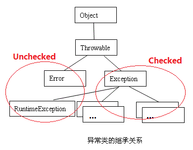

# Checked vs Unchecked Exceptions in Java #

[https://www.geeksforgeeks.org/checked-vs-unchecked-exceptions-in-java/](https://www.geeksforgeeks.org/checked-vs-unchecked-exceptions-in-java/)

[1.Checked](#checked)

[2.Unchecked](#unchecked)

[3.Why two types?](#why-two-types?)

[4.Should we make our exceptions checked or unchecked?](#should-we-make-our-exceptions-checked-or-unchecked)

In Java, there are two types of exceptions:

## Checked ##

Checked are the exceptions that are checked at compile time. If some code within a method throws a checked exception, then the method must either handle the exception(`try...catch...`) or it must specify the exception using `throws` keyword.

For example, consider the following Java program that opens file at location “C:\test\a.txt” and prints the first three lines of it. The program doesn’t compile, because the function `main()` uses `FileReader()` and `FileReader()` throws a checked exception `FileNotFoundException`. It also uses `readLine()` and `close()` methods, and these methods also throw checked exception `IOException`

	import java.io.*; 
	
	class Main { 
		public static void main(String[] args) { 
			FileReader file = new FileReader("C:\\test\\a.txt"); 
			BufferedReader fileInput = new BufferedReader(file); 
			
			// Print first 3 lines of file "C:\test\a.txt" 
			for (int counter = 0; counter < 3; counter++) 
				System.out.println(fileInput.readLine()); 
			
			fileInput.close(); 
		} 
	} 

Output:

	Exception in thread "main" java.lang.RuntimeException: Uncompilable source code - 
	unreported exception java.io.FileNotFoundException; must be caught or declared to be 
	thrown
	    at Main.main(Main.java:5)

To fix the above program, we either need to specify list of exceptions using **throws**, or we need to use **try-catch** block. We have used throws in the below program. Since `FileNotFoundException` is a subclass of `IOException`, we can just specify `IOException` in the throws list and make the above program compiler-error-free.

	import java.io.*; 
	  
	class Main { 
	    public static void main(String[] args) throws IOException { 
	        FileReader file = new FileReader("C:\\test\\a.txt"); 
	        BufferedReader fileInput = new BufferedReader(file); 
	          
	        // Print first 3 lines of file "C:\test\a.txt" 
	        for (int counter = 0; counter < 3; counter++)  
	            System.out.println(fileInput.readLine()); 
	          
	        fileInput.close(); 
	    } 
	}

Output: First three lines of file “C:\test\a.txt”

## Unchecked ##

Unchecked are the exceptions that are not checked at compiled time. In C++, all exceptions are unchecked, so it is not forced by the compiler to either handle or specify the exception. **It is up to the programmers to be civilized, and specify or catch the exceptions.**

In Java exceptions under `Error` and `RuntimeException` classes are unchecked exceptions, everything else under throwable is checked.

Consider the following Java program. It compiles fine, but it throws `ArithmeticException` when run. The compiler allows it to compile, because `ArithmeticException` is an unchecked exception.

	class Main {
		public static void main(String args[]) { 
			int x = 0; 
			int y = 10; 
			int z = y/x; 
		}
	}

Output:

	Exception in thread "main" java.lang.ArithmeticException: / by zero
	    at Main.main(Main.java:5)
	Java Result: 1

## Why two types? ##

See [Unchecked Exceptions — The Controversy](http://docs.oracle.com/javase/tutorial/essential/exceptions/runtime.html) for details.

## Should we make our exceptions checked or unchecked? ##

Following is the bottom line from [Java documents](http://docs.oracle.com/javase/tutorial/essential/exceptions/runtime.html)

>If a client can reasonably be expected to recover from an exception, make it a checked exception. If a client cannot do anything to recover from the exception, make it an unchecked exception

