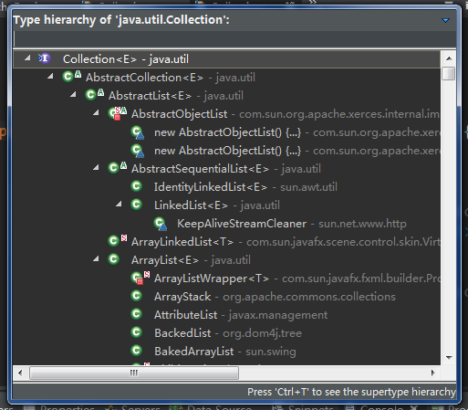

# Eclipse如何查看接口实现类快捷键 #

tag:Java Eclipse

[https://blog.csdn.net/xiamiflying/article/details/59086201](https://blog.csdn.net/xiamiflying/article/details/59086201)

1. 找到要打开的接口类

2. 双击接口名选中

3. 按Ctrl+T打开接口实现类

以List接口为例，如下所示

