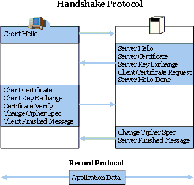
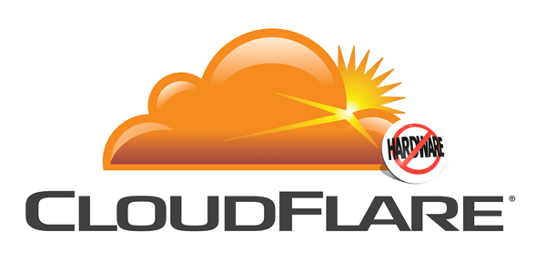
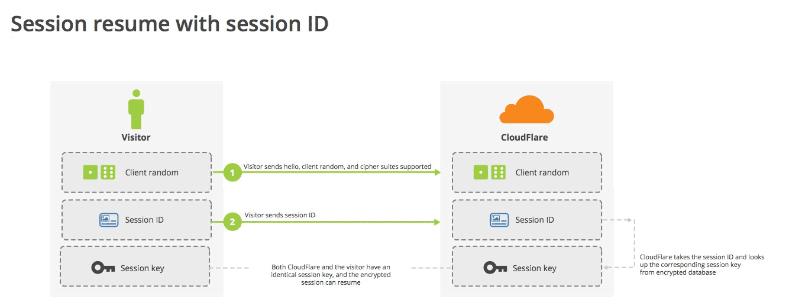

# SSL/TLS协议运行机制的概述 #

[本文转自此处1](http://www.ruanyifeng.com/blog/2014/02/ssl_tls.html)

[本文转自此处2](http://www.ruanyifeng.com/blog/2014/09/illustration-ssl.html)

---

[1.作用](#作用)

[2.历史](#历史)

[3.基本的运行过程](#基本的运行过程)

[4.握手阶段的详细过程](#握手阶段的详细过程)

[4.1.客户端发出请求（ClientHello）](#客户端发出请求clienthello)

[4.2.服务器回应（SeverHello）](#服务器回应severhello)

[4.3.客户端回应](#客户端回应)

[4.4.服务器的最后回应](#服务器的最后回应)

[5.参考链接](#参考链接)

[6.图解SSL/TLS协议](#图解ssltls协议)

[6.1.SSL协议的握手过程](#ssl协议的握手过程)

[6.2.私钥的作用](#私钥的作用)

[6.3.DH算法的握手阶段](#dh算法的握手阶段)

[6.4.session的恢复](#session的恢复)

互联网的通信安全，建立在SSL/TLS协议之上。

本文简要介绍SSL/TLS协议的运行机制。文章的重点是设计思想和运行过程，不涉及具体的实现细节。如果想了解这方面的内容，请参阅[RFC文档](http://tools.ietf.org/html/rfc5246)。

## 作用 ##

不使用SSL/TLS的HTTP通信，就是不加密的通信。所有信息明文传播，带来了三大风险。

1. **窃听风险**（eavesdropping）：第三方可以获知通信内容。

2. **篡改风险**（tampering）：第三方可以修改通信内容。

3. **冒充风险**（pretending）：第三方可以冒充他人身份参与通信。

SSL/TLS协议是为了解决这三大风险而设计的，希望达到：

1. 所有信息都是加密传播，第三方无法窃听。

2. 具有校验机制，一旦被篡改，通信双方会立刻发现。

3. 配备身份证书，防止身份被冒充。

互联网是开放环境，通信双方都是未知身份，这为协议的设计带来了很大的难度。而且，协议还必须能够经受所有匪夷所思的攻击，这使得SSL/TLS协议变得异常复杂。

## 历史 ##

互联网加密通信协议的历史，几乎与互联网一样长。

- 1994年，NetScape公司设计了SSL协议（Secure Sockets Layer）的1.0版，但是未发布。

- 1995年，NetScape公司发布SSL 2.0版，很快发现有严重漏洞。

- 1996年，SSL 3.0版问世，得到大规模应用。

- 1999年，互联网标准化组织ISOC接替NetScape公司，发布了SSL的升级版TLS 1.0版。

- 2006年和2008年，TLS进行了两次升级，分别为TLS 1.1版和TLS 1.2版。最新的变动是2011年TLS 1.2的修订版。

目前，应用最广泛的是TLS 1.0，接下来是SSL 3.0。但是，主流浏览器都已经实现了TLS 1.2的支持。

TLS 1.0通常被标示为SSL 3.1，TLS 1.1为SSL 3.2，TLS 1.2为SSL 3.3。

## 基本的运行过程 ##

SSL/TLS协议的基本思路是采用[公钥加密法](https://en.wikipedia.org/wiki/Public-key_cryptography)，也就是说，客户端先向服务器端索要公钥，然后用**公钥加密信息**，服务器收到密文后，**用自己的私钥解密**。

但是，这里有两个问题。

- 如何保证公钥不被篡改？

解决方法：将公钥放在数字证书中。只要证书是可信的，公钥就是可信的。

- 公钥加密计算量太大，如何减少耗用的时间？

解决方法：每一次对话（session），客户端和服务器端都生成一个"对话密钥"（session key），用它来加密信息。由于"对话密钥"是对称加密，所以运算速度非常快，而服务器公钥只用于加密"对话密钥"本身，这样就减少了加密运算的消耗时间。

因此，SSL/TLS协议的**基本过程**是这样的：

1. 客户端向服务器端索要并验证公钥。

2. 双方协商生成"对话密钥"。

3. 双方采用"对话密钥"进行加密通信。

上面过程的前两步，又称为"握手阶段"（handshake）。

## 握手阶段的详细过程 ##

"握手阶段"涉及四次通信，我们一个个来看。需要注意的是，"握手阶段"的所有通信都是明文的。

### 客户端发出请求（ClientHello） ###

首先，客户端（通常是浏览器）先向服务器发出加密通信的请求，这被叫做ClientHello请求。

在这一步，客户端主要向服务器提供以下信息。

1. 支持的协议版本，比如TLS 1.0版。

2. 一个客户端生成的**随机数**，稍后用于生成"对话密钥"。

3. 支持的加密方法，比如RSA公钥加密。

4. 支持的压缩方法。

这里需要注意的是，客户端发送的信息之中不包括服务器的域名。也就是说，理论上服务器只能包含一个网站，否则会分不清应该向客户端提供哪一个网站的数字证书。这就是为什么通常一台服务器只能有一张数字证书的原因。

对于虚拟主机的用户来说，这当然很不方便。2006年，TLS协议加入了一个[Server Name Indication](http://tools.ietf.org/html/rfc4366)扩展，允许客户端向服务器提供它所请求的域名。

### 服务器回应（SeverHello） ###

服务器收到客户端请求后，向客户端发出回应，这叫做SeverHello。服务器的回应包含以下内容。

1. 确认使用的加密通信协议版本，比如TLS 1.0版本。如果浏览器与服务器支持的版本不一致，服务器关闭加密通信。

2. 一个服务器生成的**随机数**，稍后用于生成"对话密钥"。

3. 确认使用的加密方法，比如RSA公钥加密。

4. 服务器证书。

除了上面这些信息，如果服务器需要确认客户端的身份，就会再包含一项请求，要求客户端提供"客户端证书"。比如，金融机构往往只允许认证客户连入自己的网络，就会向正式客户提供USB密钥，里面就包含了一张客户端证书。

### 客户端回应 ###

客户端收到服务器回应以后，首先验证服务器证书。如果证书不是可信机构颁布、或者证书中的域名与实际域名不一致、或者证书已经过期，就会向访问者显示一个警告，由其选择是否还要继续通信。

如果证书没有问题，客户端就会从证书中取出服务器的公钥。然后，向服务器发送下面三项信息。

1. 一个**随机数**。该随机数用服务器公钥加密，防止被窃听。

2. 编码改变通知，表示随后的信息都将用双方商定的加密方法和密钥发送。

3. 客户端握手结束通知，表示客户端的握手阶段已经结束。这一项同时也是前面发送的所有内容的hash值，用来供服务器校验。

上面第一项的随机数，是整个握手阶段出现的第三个随机数，又称"pre-master key"。有了它以后，客户端和服务器就同时有了三个随机数，接着双方就用事先商定的加密方法，各自生成本次会话所用的同一把"会话密钥"。

至于为什么一定要用三个随机数，来生成"会话密钥"，[dog250](http://blog.csdn.net/dog250/article/details/5717162)解释得很好：

>"不管是客户端还是服务器，都需要随机数，这样生成的密钥才不会每次都一样。由于SSL协议中证书是静态的，因此十分有必要引入一种随机因素来保证协商出来的密钥的随机性。

>对于RSA密钥交换算法来说，pre-master-key本身就是一个随机数，再加上hello消息中的随机，三个随机数通过一个密钥导出器最终导出一个对称密钥。

>pre master的存在在于SSL协议不信任每个主机都能产生完全随机的随机数，如果随机数不随机，那么pre master secret就有可能被猜出来，那么仅适用pre master secret作为密钥就不合适了，因此必须引入新的随机因素，那么客户端和服务器加上pre master secret三个随机数一同生成的密钥就不容易被猜出了，一个伪随机可能完全不随机，可是是三个伪随机就十分接近随机了，每增加一个自由度，随机性增加的可不是一。"

此外，如果前一步，服务器要求客户端证书，客户端会在这一步发送证书及相关信息。

### 服务器的最后回应 ###

服务器收到客户端的第三个随机数pre-master key之后，计算生成本次会话所用的"会话密钥"。然后，向客户端最后发送下面信息。

1. 编码改变通知，表示随后的信息都将用双方商定的加密方法和密钥发送。

2. 服务器握手结束通知，表示服务器的握手阶段已经结束。这一项同时也是前面发送的所有内容的hash值，用来供客户端校验。

## 参考链接 ##

<ul>

<li>MicroSoft TechNet, <a href="http://technet.microsoft.com/en-us/library/cc785811(v=ws.10).aspx" target="_blank">SSL/TLS in Detail</a>
</li>

<li>Jeff Moser, <a href="http://www.moserware.com/2009/06/first-few-milliseconds-of-https.html" target="_blank">The First Few Milliseconds of an HTTPS Connection</a>
</li>

<li>Wikipedia, <a href="http://en.wikipedia.org/wiki/Transport_Layer_Security" target="_blank">Transport Layer Security</a>
</li>

<li>StackExchange, <a href="http://security.stackexchange.com/questions/20803/how-does-ssl-work" target="_blank">How does SSL work?</a>
</li>

</ul>

## 图解SSL/TLS协议 ##

本周(2014.09.20)，[CloudFlare](https://www.cloudflare.com/)宣布，开始提供Keyless服务，即你把网站放到它们的CDN上，不用提供自己的私钥，也能使用SSL加密链接。

我看了CloudFlare的说明（[这里](https://blog.cloudflare.com/announcing-keyless-ssl-all-the-benefits-of-cloudflare-without-having-to-turn-over-your-private-ssl-keys/)和[这里](http://blog.cloudflare.com/keyless-ssl-the-nitty-gritty-technical-details/)），突然意识到这是绝好的例子，可以用来说明SSL/TLS协议的运行机制。它配有插图，很容易看懂。

### SSL协议的握手过程 ###

开始加密通信之前，客户端和服务器首先必须建立连接和交换参数，这个过程叫做握手（handshake）。

假定客户端叫做爱丽丝，服务器叫做鲍勃，整个握手过程可以用下图说明。

握手阶段分成五步。

1. 第一步，爱丽丝给出协议版本号、一个客户端生成的随机数（Client random），以及客户端支持的加密方法。

2. 第二步，鲍勃确认双方使用的加密方法，并给出数字证书、以及一个服务器生成的随机数（Server random）。

3. 第三步，爱丽丝确认数字证书有效，然后生成一个新的随机数（Premaster secret），并使用数字证书中的公钥，加密这个随机数，发给鲍勃。

4. 第四步，鲍勃使用自己的私钥，获取爱丽丝发来的随机数（即Premaster secret）。

5. 第五步，爱丽丝和鲍勃根据约定的加密方法，使用前面的三个随机数，生成"对话密钥"（session key），用来加密接下来的整个对话过程。

上面的五步，画成一张图，就是下面这样。

### 私钥的作用 ###

握手阶段有三点需要注意。

1. 生成对话密钥一共需要三个随机数。

2. 握手之后的对话使用"对话密钥"加密（对称加密），服务器的公钥和私钥只用于加密和解密"对话密钥"（非对称加密），无其他作用。

3. 服务器公钥放在服务器的数字证书之中。

从上面第二点可知，整个对话过程中（握手阶段和其后的对话），**服务器的公钥和私钥只需要用到一次**。这就是CloudFlare能够提供Keyless服务的根本原因。

某些客户（比如银行）想要使用外部CDN，加快自家网站的访问速度，但是出于安全考虑，不能把私钥交给CDN服务商。这时，完全可以把私钥留在自家服务器，只用来解密对话密钥，其他步骤都让CDN服务商去完成。

上图中，银行的服务器只参与第四步，后面的对话都不再会用到私钥了。

### DH算法的握手阶段 ###

整个握手阶段都不加密（也没法加密），都是明文的。因此，如果有人窃听通信，他可以知道双方选择的加密方法，以及三个随机数中的两个。整个通话的安全，只取决于第三个随机数（Premaster secret）能不能被破解。

虽然理论上，只要服务器的公钥足够长（比如2048位），那么Premaster secret可以保证不被破解。但是为了足够安全，我们可以考虑把握手阶段的算法从默认的RSA算法，改为 Diffie-Hellman算法（简称DH算法）。

采用DH算法后，Premaster secret不需要传递，双方只要交换各自的参数，就可以算出这个随机数。

上图中，第三步和第四步由传递Premaster secret变成了传递DH算法所需的参数，然后双方各自算出Premaster secret。这样就提高了安全性。

### session的恢复 ###

握手阶段用来建立SSL连接。如果出于某种原因，对话中断，就需要重新握手。

这时有两种方法可以恢复原来的session：一种叫做session ID，另一种叫做session ticket。

session ID的思想很简单，就是每一次对话都有一个编号（session ID）。如果对话中断，下次重连的时候，只要客户端给出这个编号，且服务器有这个编号的记录，双方就可以重新使用已有的"对话密钥"，而不必重新生成一把。

上图中，客户端给出session ID，服务器确认该编号存在，双方就不再进行握手阶段剩余的步骤，而直接用已有的对话密钥进行加密通信。

session ID是目前所有浏览器都支持的方法，但是它的缺点在于session ID往往只保留在一台服务器上。所以，如果客户端的请求发到另一台服务器，就无法恢复对话。session ticket就是为了解决这个问题而诞生的，目前只有Firefox和Chrome浏览器支持。

上图中，客户端不再发送session ID，而是发送一个服务器在上一次对话中发送过来的session ticket。这个session ticket是加密的，只有服务器才能解密，其中包括本次对话的主要信息，比如对话密钥和加密方法。当服务器收到session ticket以后，解密后就不必重新生成对话密钥了。

