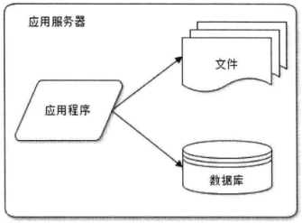
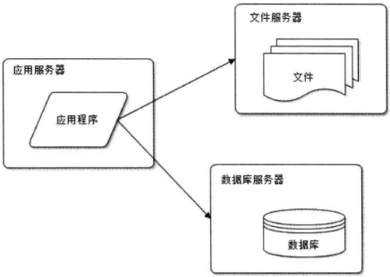
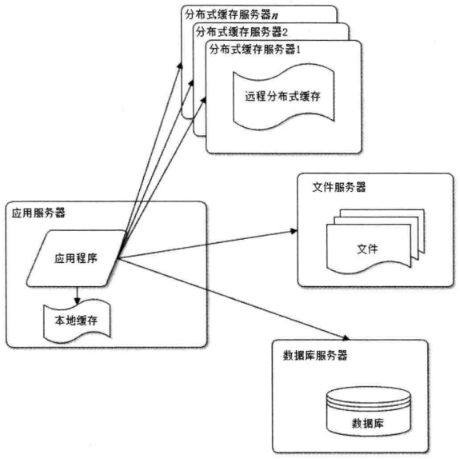
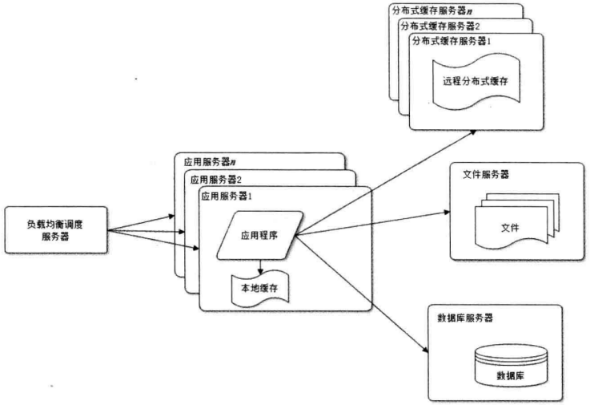
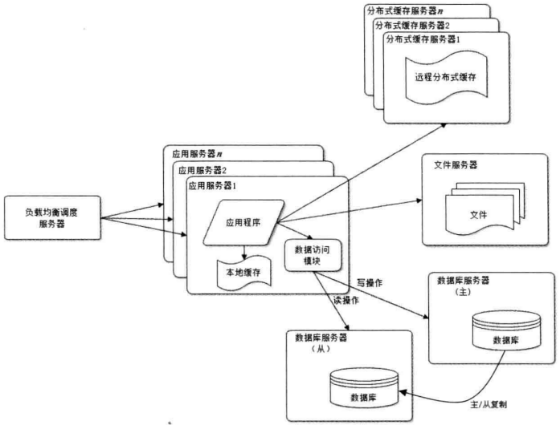
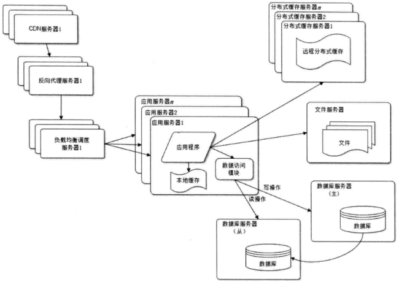
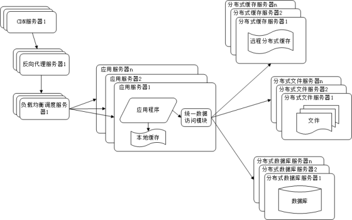
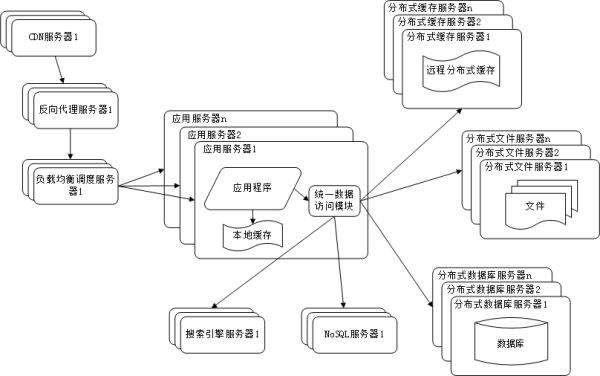
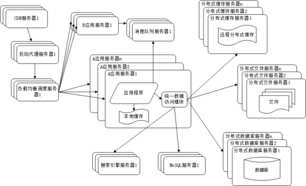
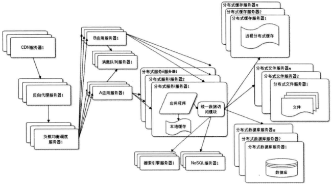

# 大型网站架构演化 #

[1.大型网站软件系统的特点](#大型网站软件系统的特点)

[2.大型网站架构演化发展历程](#大型网站架构演化发展历程)

[2.1.初始阶段的网站架构](#初始阶段的网站架构)

[2.1.1.需求/解决问题1](#需求解决问题1)

[2.1.2.架构1](#架构1)

[2.2.应用服务和数据服务分离](#应用服务和数据服务分离)

[2.2.1.需求/解决问题2](#需求解决问题2)

[2.2.2.架构2](#架构2)

[2.3.使用缓存改善网站性能](#使用缓存改善网站性能)

[2.3.1.需求/解决问题3](#需求解决问题3)

[2.3.2.架构3](#架构3)

[2.4.使用应用服务器集群改善网站的并发处理能力](#使用应用服务器集群改善网站的并发处理能力)

[2.4.1.需求/解决问题4](#需求解决问题4)

[2.4.2.架构4](#架构4)

[2.5.数据库读写分离](#数据库读写分离)

[2.5.1.需求/解决问题5](#需求解决问题5)

[2.5.2.架构5](#架构5)

[2.6.使用分布式文件系统和分布式数据库系统](#使用分布式文件系统和分布式数据库系统)

[2.6.1.需求/解决问题6](#需求解决问题6)

[2.6.2.架构6](#架构6)

[2.7.使用分布式文件系统和分布式数据库系统](#使用分布式文件系统和分布式数据库系统)

[2.7.1.需求/解决问题7](#需求解决问题7)

[2.7.2.架构7](#架构7)

[2.8.使用NoSQL和搜索引擎](#使用nosql和搜索引擎)

[2.8.1.需求/解决问题8](#需求解决问题8)

[2.8.2.架构8](#架构8)

[2.9.业务拆分](#业务拆分)

[2.9.1.需求/解决问题9](#需求解决问题9)

[2.9.2.架构9](#架构9)

[2.10.分布式服务](#分布式服务)

[2.10.1.需求/解决问题10](#需求解决问题10)

[2.10.2.架构10](#架构10)

[2.11.历程小结](#历程小结)

[3.大型网站架构演化的价值观](#大型网站架构演化的价值观)

[3.1.大型网站架构技术的核心价值是随网站所需灵活应对](#大型网站架构技术的核心价值是随网站所需灵活应对)

[3.2.驱动大型网站技术发展的主要力量是网站的业务发展](#驱动大型网站技术发展的主要力量是网站的业务发展)

[4.网站架构设计误区](#网站架构设计误区)

[4.1.一味追随大公司的解决方案](#一味追随大公司的解决方案)

[4.2.为了技术而技术](#为了技术而技术)

[4.3.企图用技术解决所有问题](#企图用技术解决所有问题)

[5.小结](#小结)

## 大型网站软件系统的特点 ##

与传统企业应用相比，大型互联网应用系统有以下七大特点：

- 高并发，大流量

- 高可用：系统7×24小时不间断服务；

- 海量数据：需要存储、管理海量数据，需要使用大量服务器；

- 用户分布广泛，网络情况复杂：许多大型互联网都是为全球用户提供服务的，用户分布范围广，各地网络情况千差万别；

- 安全环境恶劣：由于互联网的开放性，使得互联网更容易受到攻击，大型网站几乎每天都会被黑客攻击；

- 需求快速变更，发布频繁：和传统软件的版本发布频率不同，互联网产品为快速适应市场，满足用户需求，其产品发布频率是极高的；

- 渐进式发展：与传统软件产品或企业应用系统一开始就规划好全部的功能和非功能需求不同，几乎所有的大型互联网网站都是从一个小网站开始，渐进地发展起来的。

## 大型网站架构演化发展历程 ##

### 初始阶段的网站架构 ###

#### 需求/解决问题1 ####

从无到有

#### 架构1 ####

应用程序、数据库、文件等所有的资源都在一台服务器上。

### 应用服务和数据服务分离 ###

#### 需求/解决问题2 ####

随着网站业务的发展，越来越多的用户访问导致性能越来越差，越来越多的数据导致存储空间不足。

#### 架构2 ####

应用和数据分离后整个网站使用三台服务器，其对硬件资源的要求各不相同：

- 应用服务器处理大量业务逻辑，需要更快更强大的**CPU**；

- 数据库服务器快速磁盘检索和数据缓存，需要更快的**磁盘**和更大的**内存**；
 
- 文件服务器存储大量用户上传的文件，需要更大的**磁盘**。

### 使用缓存改善网站性能 ###

#### 需求/解决问题3 ####

用户逐渐增多，数据库压力太大导致访问延迟。

#### 架构3 ####

根据二八定律：80%的业务访问集中在20%的数据上，把小部分数据缓存在内存中，可减少数据库访问压力。

类型|原理|优点|缺点
---|---|---|---
本地缓存|缓存在应用服务器|访问速度更快|受应用服务器内存限制
分布式缓存|部署大内存缓存服务器集群|理论上不受内存容量限制|-

### 使用应用服务器集群改善网站的并发处理能力 ###

#### 需求/解决问题4 ####

单一应用服务器能够处理的请求连接有限，在网站访问高峰期，应用服务器称为整个网站的瓶颈。

#### 架构4 ####

增加服务器分担原有服务器的访问及存储压力。

通过**负载均衡调度服务器**，可将来值用户浏览器的访问请求分发到应用服务器集群中的任何一台服务器上，如果有更多的用户，就在集群中加入更多的应用服务器，使应用服务器的负载压力不再成为整个网站的瓶颈。

### 数据库读写分离 ###

#### 需求/解决问题5 ####

网站绝大部分数据读操作访问都可以不通过数据库就能完成，但是仍有一部分读操作（缓存访问不命中、缓存过期）和全部的写操作需要访问数据库，在网站的用户达到一定规模后，数据库因为负载压力过高而成为网站瓶颈。

#### 架构5 ####

目前大部分主流数据库提供主从热备功能，通过配置两台数据库主从关系，可以将一台数据库服务器的数据更新同步到另一台服务器上。网站使用数据库的这一功能，实现数据库读写分离，从而改善数据库负载压力。

应用服务器写数据时，访问主数据库，主数据库通过主从复制机制将数据更新同步到从数据库；当应用服务器读数据时，可通过从数据库获得数据。通常在应用服务器端使用专门的数据访问模块，使数据库读写分离对应用透明。

### 使用分布式文件系统和分布式数据库系统 ###

#### 需求/解决问题6 ####

随着网站业务不断发展，用户规模越来越大，由于中国网络环境复杂，不同地区的用户访问网站时，速度差别极大。

有研究表明，网站访问延迟和用户流失率正相关，网站访问越慢，用户越容易失去耐心而离开。为了提供更好的用户体验，留住用户，网站需要加速网站访问速度。

#### 架构6 ####

主要手段有使用 CDN 和反向代理。CDN和反向代理目的都是尽早返回数据、加快访问速度、减轻后端服务器负载压力。

1. CDN：部署在网络提供商机房。用户请求网站服务时，可从距离自己最近的网络提供商机房获取数据。

2. 反向代理：部署在网站中心机房。用户请求到达中心机房后，首先访问反向代理服务器，如果反向代理服务器缓存着用户请求的资源，就将其直接返回给用户。

### 使用分布式文件系统和分布式数据库系统 ###

#### 需求/解决问题7 ####

任何强大的单一服务器都满足不了大型网站持续增长的业务需求。数据库经过读写分离后，从一台服务器拆分成两台服务器，但是随着网站业务的发展依然不能满足需求。

#### 架构7 ####

这时需要使用分布式数据库。文件系统也一样，需要使用分布式文件系统。

分布式数据库是网站数据库拆分的最后手段，只有在单表数据规模非常庞大的时候才使用。不到不得已时，网站更常用的数据库拆分手段是**业务分库**，将不同业务的数据部署在不同的物理服务器上。

### 使用NoSQL和搜索引擎 ###

#### 需求/解决问题8 ####

随着网站业务越来越复杂，对数据存储和检索的需求也越来越复杂。

#### 架构8 ####

1. NoSQL和搜索引擎都是源自互联网的技术手段，可伸缩的分布式特性更好；

2. 应用服务器通过一个统一数据访问模块访问各种数据。

### 业务拆分 ###

#### 需求/解决问题9 ####

业务场景日益复杂。

#### 架构9 ####

1. 将整个网站业务分成不同产品线（如大型购物交易网站拆分为首页、商铺、订单、买家、卖家），分归不同业务团队负责。

2. 根据产品线划分，将网站拆分成不同应用，每个应用独立部署维护。应用间关联方式：

    a. 超链接（首页上导航链接每个应用地址）；

    b. 通过消息队列进行数据分发；

    c. 通过同一数据存储系统构成一个关联的完整系统（最多）。

### 分布式服务 ###

#### 需求/解决问题10 ####

随着业务拆分越来越小，存储系统越来越庞大，应用系统的整体复杂度呈指数级增加，部署维护越来越困难。由于**所有应用**要和**所有数据库系统**连接，在数万台服务器规模的网站中，这些连接的数目是服务器规模的平方，导致数据库连接资源不足，拒绝服务。

#### 架构10 ####

既然每一个应用系统都需要执行许多相同的业务操作，比如用户管理、商品管理等，那么可以将这些共用的业务提取出来，独立部署。由这些可复用的业务连接数据库，提供共用业务服务，而应用系统只需要管理用户界面，通过分布式服务调用共用业务服务完成具体业务操作。

### 历程小结 ###

大型网站的架构演化到这里，基本上大多数的技术问题都得以解决，诸如跨数据中心的实时数据同步、事务特性支持和具体网站业务相关的问题也都可以通过组合改进现有技术架构解决。

但事物发展到一定阶段，就会拥有自身的发展冲动，摆脱其初衷，向着使自己更强大的方向发展，既然大型网站架构解决了海量数据的管理和高并发事物的处理，那么就可以吧这些解决方案应用到网站自身以外的业务上去，目前许多大型网站都开始建设云计算平台，将计算机作为一种基础资源出售，中小网站不需要再关心技术架构问题，只需要按需付费，就可以是网站随着业务的增长逐渐获得更大的存储空间和更多的计算资源。

## 大型网站架构演化的价值观 ##

这个世界没有哪个网站从诞生起就是大型网站；也没有哪个网站第一次发布就拥有庞大的用户，高并发的访问，海量的数据；大型网站都是从小型网站发展而来。网站的 价值在于它能为用户提供什么价值，在于网站能做什么，而不在于它是怎么做的，所以 在网站还很小的时候就去追求网站的架构是舍本逐末，得不偿失的。**小型网站最需要做 的就是为用户提供好的服务来创造价值，得到用户的认可，活下去，野蛮生长。**

所以我们看到，一方面是随着互联网的高速发展，越来越多新的软件技术和产品从 互联网公司诞生，挑战传统软件巨头的江湖地位。另一方面却是中小网站十几年如一日 地使用LAMP技术（Linux + Apache+MySQL+PHP )开发自己的网站，因为LAMP既便宜又简单，而且对付一个中小型网站绰绰有余。

### 大型网站架构技术的核心价值是随网站所需灵活应对 ###

大型网站架构技术的核心价值不是从无到有搭建一个大型网站，而是能够伴随小型 网站业务的逐步发展，慢慢地演化成一个大型网站。在这个漫长的技术演化过程中，不需要放弃什么，不需要推翻什么，不需要剧烈的革命，就那么润物细无声地把一个只有 一台服务器，几百个用户的小网站演化成一个几十万台服务器，数十亿用户的大网站。今 天我们看到的大型网站，Google，Facebook，Taobao，Baidu莫不遵循这样的技术演化路线。

### 驱动大型网站技术发展的主要力量是网站的业务发展 ###

创新的业务发展模式对网站架构逐步提出更高要求，才使得创新的网站架构得以发展成熟。**是业务成就了技术，是事业成就了人，而不是相反。**所以网站架构师应该对成就自己技术成绩的网站事业心存感恩，并努力提高技术回馈业务，才能在快速发展的互联网领域保持持续进步。

不过我们也看到有些传统企业投身互联网，在业务问题还没有理清楚的时候就从外 面挖来许多技术高手，仿照成功的互联网公司打造技术平台，这无疑是南辕北辙，缘木 求鱼。而这些技术高手离幵了它们熟悉的环境和工作模式，也是张飞拿着绣花针使不上劲来。

## 网站架构设计误区 ##

### 一味追随大公司的解决方案 ###

由于大公司巨大成功的光环效应，再加上从大公司挖来的技术高手的影响，网站在讨论架构决策时，最有说服力的一句话就成了“淘宝就是这么搞的”或者“Facebook就是这么搞的”。 

大公司的经验和成功模式固然重要，值得学习借鉴，但如果因此而变得盲从，就失去了坚持自我的勇气，在架构演化的道路上迟早会迷路。 

### 为了技术而技术 ###

网站技术是为业务而存在的，除此毫无意义。在技术选型和架构设计中，脱离网站业务发展的实际，一味追求时髦的新技术，可能会将网站技术发展引入崎岖小道，架构之路越走越难。 

### 企图用技术解决所有问题 ###

最典型的例子就是2012年年初12306故障事件后，软件开发技术界的反应。 

各路专业和非专业人士众说纷纭地帮12306的技术架构出谋划策，甚至有人提议帮12306写一个开源的网站，解决其大规模并发访问的问题。 

12306真正的问题其实不在于它的技术架构，而在于它的业务架构：12306根本就不应该在几亿中国人一票难求的情况下以窗口售票的模式在网上售票（零点开始出售若干天后的车票）。12306需要重构的不仅是它的技术架构，更重要的是它的业务架构：调整业务需求，换一种方式卖票，而不要去搞促销秒杀这种噱头式的游戏。 

后来证明12306确实是朝这个方向发展的：在售票方式上引入了排队机制、整点售票调整为分时段售票。其实如果能控制住并发访问的量，很多棘手的技术问题也就不是什么问题了。 

**技术是用来解决业务问题的，而业务的问题，也可以通过业务的手段去解决。** 

## 小结 ##

时至今日，大型网站的架构演化方案已经非常成熟，各种技术方案也逐渐产品化。许多小型网站已经慢慢不需要再经历大型网站经历过的架构演化之路就可以逐步发展壮大，因为现在越来越多的网站从建立之初就是搭建在大型网站提供的云计算服务基础之上，所需要的一切技术资源：计算、存储、网络都可以按需购买，线性伸缩，不需要自己一点一点地拼凑各种资源，综合使用各种技术方案逐步去完善自己的网站架构了。 

所以能亲身经历一个网站从小到太的架构演化过程的网站架构师越来越少，虽然过去有这种经历的架构师也很少（从小型网站发展成大型网站的机会本来就极少），但是将来可能真就没有了。

但也正因为网站架构技术演化过程难以重现，所以网站架构师更应该对这个过程深刻了解，理解已成熟的网站架构技术方案的来龙去脉和历史渊源，在技术选型和架构决策时才能有的放矢，直击要害。

