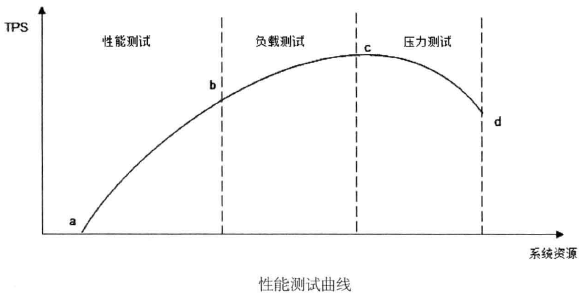

# 瞬时响应：网站的高性能架构 #

## 什么叫高性能的网站？ ##

两个网站性能架构设计方案：A方案和B方案，

- A方案在小于100个并发用户访问 时，每个请求的响应时间是1秒，当并发请求达到200的时候，请求的响应时间将骤增 到10秒。
- B方案不管是100个并发用户访问还是200个并发用户访问，每个请求的响应 时间都差不多是1.5秒。

哪个方案的性能好？如果老板说“我们要改善网站的性能”，他指的是什么？

同类型的两个网站，X网站服务器平均每个请求的处理时间是500毫秒，Y网站服务 器平均每个请求的处理时间是1000毫秒，为什么用户却反映Y网站的速度快呢？

网站性能是客观的指标，可以具体体现到**响应时间、吞吐量等**技术指标，同时也是主观的感受，而感受**则是一种与具体参与者相关的微妙的东西，用户的感受和工程师感受不同**，不同的用户感受也不同。

## 网站性能测试 ##

性能测试是性能优化的前提和基础，也是性能优化结果的检查和度量标准。不同视角下的网站性能有不同的标准，也有不同的优化手段。

### 不同视角下的网站性能 ###

软件工程师说到网站性能的时候，通常和用户说的不一样。

#### 用户视角的网站性能 ####

从用户角度，网站性能就是用**户在浏览器上直观感受到的网站响应速度快还是慢**。 用户感受到的时间，包括用户计算机和网站服务器通信的时间、网站服务器处理的时间、 用户计算机浏览器构造请求解析响应数据的时间。

不同计算机的性能差异，不同浏览器解析HTML速度的差异，不同网络运营商提供 的互联网宽带服务的差异，这些差异最终导致用户感受到的响应延迟可能会远远大于网站服务器处理请求需要的时间。

在实践中，使用一些前端架构优化手段，通过

1. 优化页面HTML式样、
2. 利用浏览器端的并发和异步特性、
3. 调整浏览器缓存策略、
4. 使用CDN服务、反向代理等手段，

使浏览器尽快地显示用户感兴趣的内容、尽可能近地获取页面内容，即使不优化应用程序和架构， 也可以很大程度地改善用户视角下的网站性能。

#### 开发人员视角的网站性 ####

开发人员关注的主要是应用程序本身及其相关子系统的性能，包括响应延迟、系统 吞吐量、并发处理能力、系统稳定性等技术指标。

主要的优化手段有

1. 使用缓存加速数据读取，
2. 使用集群提高吞吐能力，
3. 使用异步消息加快请求响应及实现削峰，
4. 使用代码优化手段改善程序性能。

#### 运维人员视角的网站性能 ####

运维人员更关注基础设施性能和资源利用率，如网络运营商的带宽能力、服务器硬 件的配置、数据中心网络架构、服务器和网络带宽的资源利用率等。

主要优化手段有

1. 建设优化骨干网、
2. 使用高性价比定制服务器、
3. 利用虚拟化技术优化资源利用等。

### 性能测试指标 ###

不同视角下有不同的性能标准，不同的标准有不同的性能测试指标，从**开发和测试人员的视角**，网站性能测试的主要指标有响应时间、并发数、吞吐量、性能计数器等。

#### 响应时间 ####

**指应用执行一个操作需要的时间，包括从发出请求开始到收到最后响应数据所需要的时间**。响应时间是系统最重要的性能指标，直观地反映了系统的“快慢”。

操作|响应时间
---|---
打开一个网站|几秒
在DB中查询一条记录（有索引）|十几毫秒
机械磁盘一次寻址定位|4毫秒
从机械磁盘顺序读取1MB数据|2毫秒
从SSD磁盘顺序读取1MB数据|0.3毫秒
从远程分布式缓存Redis读取一个数据|0.5毫秒
从内存中读取1MB数据|十几微秒
Java程序本地方法调用|几微秒
网络传输2KB数据|1微秒

测试程序通过模拟应用程序，记录收到响应和发出请求之间的时间差来计算系统响 应时间。但是记录及获取系统时间这个操作也需要花费一定的时间，如果测试目标操作 本身需要花费的时间极少，比如几微秒，那么测试程序就无法测试得到系统的响应时间。

实践中通常采用的办法是**重复请求**，比如一个请求操作重复执行一万次，测试一万次执行需要的总响应时间之和，然后除以一万，得到单次请求的响应时间。

#### 并发数 ####

**指系统能够同时处理请求的数目**，这个数字也反映了系统的负载特性。对于网站而 言，并发数即网站并发用户数，指同时提交请求的用户数目

与网站并发用户数相对应的还有网站在线用户数（当前登录网站的用户总数）和网站系统用户数（可能访问系统的总用户数，对多数网站而言就是注册用户数)。其数量比较关系为：

网站系统用户数 >> 网站在线用户数 >> 网站并发用户数

在网站产品设计初期，产品经理和运营人员就需要规划不同发展阶段的网站系统用户数，并以此为基础，根据产品特性和运营手段，推算在线用户数和并发用户数。这些指标将成为系统非功能设计的重要依据。

现实中，经常看到某些网站，特别是电商类网站，市场推广人员兴致勃勃地打广告 打折促销，用户兴致勃勃地去抢购，结果活动刚一开始，就因为并发用户数超过网站最 大负载而响应缓慢，急性子的用户不停刷新浏览器，导致系统并发数更高，最后以服务器系统崩溃，用户浏览器显示“Service is too busy”而告终。出现这种情况，有可能是网站技术准备不充分导致，也有可能是运营人员错误地评估并发用户数导致。

**测试程序通过多线程模拟并发用户的办法来测试系统的并发处理能力**，为了真实模拟用户行为，测试程序并不是启动多线程然后不停地发送请求，而是在两次请求之间加入一个随机等待时间，这个时间被称作思考时间。

### 吞吐量 ###

**指单位时间内系统处理的请求数量，体现系统的整体处理能力**。对于网站，可以用 “请求数/秒”或是“页面数/秒”来衡量，也可以用“访问人数/天”或是“处理的业务数/ 小时”等来衡量。TPS (每秒事务数）是吞吐量的一个常用量化指标，此外还有HPS (每秒HTTP请求数）、QPS (每秒查询数）等。

在系统并发数由小逐渐增大的过程中（这个过程也伴随着服务器系统资源消耗逐渐增大），系统吞吐量先是逐渐增加，达到一个极限后，随着并发数的增加反而下降，达到系统崩溃点后，系统资源耗尽，吞吐量为零。

而这个过程中，响应时间则是先保持小幅上升，到达吞吐量极限后，快速上升，到 达系统崩溃点后，系统失去响应。

---

**类比**

系统吞吐量和系统并发数，以及响应时间的关系可以形象地理解为高速公路的通行状况：**吞吐量**是每天通过收费站的车辆数目（可以换算成收费站收取的高速费），**并发数** 是高速公路上的正在行驶的车辆数目，响应时间是车速。车辆很少时，车速很快，但是收到的高速费也相应较少；随着高速公路上车辆数目的增多，车速略受影响，但是收到的高速费增加很快；随着车辆的继续增加，车速变得越来越慢，高速公路越来越堵，收费不增反降；如果车流量继续增加，超过某个极限后，任何偶然因素都会导致高速全部瘫痪，车走不动，费当然也收不着，而高速公路成了停车场（资源耗尽)。

网站性能优化的目的，除了改善用户体验的响应时间，还要尽量提高系统吞吐量，最大限度利用服务器资源。

#### 性能计数器 ####

它是描述服务器或操作系统性能的一些数据指标。包括System Load、对象与线程数、 内存使用、CPU使用、磁盘与网络I/O等指标。这些指标也是系统监控的重要参数，对 这些指标设置报警阈值，当监控系统发现性能计数器超过阈值时，就向运维和开发人员 报警，及时发现处理系统异常。

System Load即系统负载，指当前正在被CPU执行和等待被CPU执行的进程数目总 和，是反映系统忙闲程度的重要指标。多核CPU的情况下，完美情况是所有CPU都在使用，没有进程在等待处理，所以Load的理想值是CPU的数目。当Load值低于CPU数 目的时候，表示CPU有空闲，资源存在浪费；当Load值高于CPU数目的时候，表示进 程在排队等待CPU调度，表示系统资源不足，影响应用程序的执行性能。

在Linux系统 中使用top命令查看，该值是三个浮点数，表示最近1分钟，10分钟，15分钟的运行队 列平均进程数。

### 性能测试方法 ###

性能测试是一个总称，具体可细分为性能测试、负载测试、压力测试、稳定性测试。

**性能测试**

以系统设计初期规划的性能指标为预期目标，对系统不断施加压力，验证系统在资 源可接受范围内，是否能达到性能预期。

**负载测试**

对系统不断地增加并发请求以增加系统压力，直到系统的某项或多项性能指标达到 安全临界值，如某种资源已经呈饱和状态，这时继续对系统施加压力，系统的处理能力 不但不能提高，反而会下降。

**压力测试**

超过安全负载的情况下，对系统继续施加压力，直到系统崩溃或不能再处理任何请 求，以此获得系统最大压力承受能力。

**稳定性测试**

被测试系统在特定硬件、软件、网络环境条件下，给系统加载一定业务压力，使系 统运行一段较长时间，以此检测系统是否稳定。在不同生产环境、不同时间点的请求压 力是不均匀的，呈波浪特性，因此为了更好地模拟生产环境，稳定性测试也应不均匀地 对系统施加压力。

---

性能测试是一个不断对系统增加访问压力，以获得系统性能指标、最大负载能力、 最大压力承受能力的过程。所谓的增加访问压力，在系统测试环境中，就是不断增加测 试程序的并发请求数

如图中的横坐标表示消耗的系统资源，纵坐标表示系统处理能力（吞吐量)。在开 始阶段，随着并发请求数目的增加，系统使用较少的资源就达到较好的处理能力（a〜b 段），这一段是**网站的日常运行区间**，网站的绝大部分访问负载压力都集中在这一段区间，被称作性能测试，测试目标是评估系统性能是否符合需求及设计目标；

随着压力的持续 增加，系统处理能力增加变缓，直到达到一个最大值（C点），这是**系统的最大负载点**，这一段被称作负载测试。测试目标是评估当系统因为突发事件超出日常访问压力的情况 下，保证系统正常运行情况下能够承受的最大访问负载压力；

超过这个点后，再增加压力，系统的处理能力反而下降，而资源消耗却更多，直到资源消耗达到极限（d点），这 个点可以看作是**系统的崩溃点**，超过这个点继续加大并发请求数目，系统不能再处理任 何请求，这一段被称作压力测试，测试目标是评估可能导致系统崩溃的最大访问负载压力。

---

性能测试反应的是系统在实际生产环境中使用时，随着用户并发访问数量的增加，系统的处理能力。与性能曲线相对应的是用户访问的等待时间（系统响应时间）如图

在日常运行区间，可以获得最好的用户响应时间，随着并发用户数的增加，响应延迟越来越大，直到系统崩溃，用户失去响应。

### 性能测试报告 ###

测试结果报告应能够反映上述性能测试曲线的规律，阅读者可以得到系统性能是 否满足设计目标和业务要求、系统最大负载能力、系统最大压力承受能力等重要信息，如图：

### 性能优化策略 ###

如果性能测试结果不能满足设计或业务需求，那么就需要寻找系统瓶颈，分而治之，逐步优化。

#### 性能分析 ####

大型网站结构复杂，用户从浏览器发出请求直到数据库完成操作事务，中间需要经过很多环节，如果测试或者用户报告网站响应缓慢，存在性能问题，必须对请求经历的各个环节进行分析，排查可能出现性能瓶颈的地方，定位问题!

排查一个网站的性能瓶颈和排查一个程序的性能瓶颈的手法基本相同：检查请求处理的各个环节的日志，分析哪个环节响应时间不合理、超过预期；然后检查监控数据，分析影响性能的主要因素是内存、磁盘、网络、还是 CPU？是代码问题还是架构设计不合理？或者系统资源确实不足？

#### 性能优化 ####

定位产生性能问题的具体原因后，就需要进行性能优化，根据网站分层架构，可分为3大类：

1. Web 前端性能优化、
2. 应用服务器性能优化、
3. 存储服务器性能优化。

## Web前端性能优化 ##

一般说来Web前端指网站业务逻辑之前的部分，包括浏览器加载、网站视图模型、图片服务、CDN服务等，

主要优化手段有

1. 优化浏览器访问、
2. 使用反向代理、
3. CDN等。

### 浏览器访问优化 ###

#### 减少http请求 ####

HTTP协议是无状态的应用层协议，意味着每次HTTP请求都需要建立通信链路、进 行数据传输，而在服务器端，每个HTTP都需要启动独立的线程去处理。这些通信和服务的开销都很昂贵，减少HTTP请求的数目可有效提高访问性能。

减少HTTP的主要手段是合并CSS、合并JavaScript、合并图片。将浏览器一次访问 需要的JavaScnpt、CSS合并成一个文件，这样浏览器就只需要一次请求。图片也可以合 并，多张图片合并成一张，如果每张图片都有不同的超链接，可通过CSS偏移响应鼠标点击操作，构造不同的URL。

#### 使用浏览器缓存 ####

对一个网站而言，CSS、JavaScript、Logo、图标这些静态资源文件更新的频率都比 较低，而这些文件又几乎是每次HTTP请求都需要的，如果将这些文件缓存在浏览器中， 可以极好地改善性能。通过设置HTTP头中Cache-Control和Expires的属性，可设定浏览 器缓存，缓存时间可以是数天，甚至是几个月。

在某些时候，静态资源文件变化需要及时应用到客户端浏览器，这种情况，可通过 改变文件名实现，即更新JavaScript文件并不是更新JavaScript文件内容，而是生成一个新的JS文件并更新HTML文件中的引用

使用浏览器缓存策略的网站在更新静态资源时，应采用批量更新的方法，比如需要更新10个图标文件，不宜把10个文件一次全部更新，而是应一个文件一个文件逐步更 新，并有一定的间隔时间，以免用户浏览器突然大量缓存失效，集中更新缓存，造成服 务器负载骤增、网络堵塞的情况。

#### 启用压缩 ####

在服务器端对文件进行压缩，在浏览器端对文件解压缩，可有效减少通信传输的数 据量。文本文件的压缩效率可达80%以上，因此HTML、CSS、JavaScript文件启用GZip 压缩可达到较好的效果。但是压缩对服务器和浏览器产生一定的压力，在通信带宽良好, 而服务器资源不足的情况下要权衡考虑。

#### CSS放在页面最上面 、JavaScript放在页面最下面 ####

浏览器会在下载完全部CSS之后才对整个页面进行渲染，因此最好的做法是将CSS 放在页面最上面，让浏览器尽快下载CSS。JavaScript则相反，浏览器在加载JavaScript 后立即执行，有可能会阻塞整个页面，造成页面显示缓慢，因此JavaScript最好放在页面 最下面。但如果页面解析时就需要用到JavaScript,这时放在底部就不合适了。

#### 减少Cookie传输 ####

一方面，Cookie包含在每次请求和响应中，太大的Cookie会严重影响数据传输，因 此哪些数据需要写入Cookie需要慎重考虑，尽量减少Cookie中传输的数据量。另一方面， 对于某些静态资源的访问，如CSS、Script等，发送Cookie没有意义，可以考虑静态资 源使用独立域名访问，避免请求静态资源时发送Cookie,减少Cookie传输的次数。

### CDN加速 ###

CDN( Content Distribute Network，内容分发网络）的本质仍然是一个缓存，而且将数据缓存在离用户最近的地方，使用户以最快速度获取数据，即所谓网络访问第一跳

由于CDN部署在网络运营商的机房，这些运营商又是终端用户的网络服务提供商， 因此用户请求路由的第一跳就到达了 CDN服务器，当CDN中存在浏览器请求的资源时， 从CDN直接返回给浏览器，最短路径返回响应，加快用户访问速度，减少数据中心负载压力。

CDN能够缓存的一般是静态资源，如图片、文件、CSS、Script脚本、静态网页等， 但是这些文件访问频度很高，将其缓存在CDN可极大改善网页的打开速度。

### 反向代理 ###

传统代理服务器位于浏览器一侧，代理浏览器将HTTP请求发送到互联网上，而反 向代理服务器位于网站机房一侧，代理网站Web服务器接收HTTP请求。

和传统代理服务器可以保护浏览器安全一样，反向代理服务器也具有保护网站安全的作用，来自互联网的访问请求必须经过代理服务器，相当于在Web服务器和可能的网 络攻击之间建立了一个屏障。

除了安全功能，代理服务器也可以通过配置缓存功能加速Web请求。当用户第一次 访问静态内容的时候，静态内容就被缓存在反向代理服务器上，这样当其他用户访问该 静态内容的时候，就可以直接从反向代理服务器返回，加速Web请求响应速度，减轻Web 服务器负载压力。

事实上，有些网站会把动态内容也缓存在代理服务器上，比如维基百 科及某些博客论坛网站，把热门词条、帖子、博客缓存在反向代理服务器上加速用户访 问速度，当这些动态内容有变化时，通过内部通知机制通知反向代理缓存失效，反向代理会重新加载最新的动态内容再次缓存起来。

此外，反向代理也可以实现负载均衡的功能，而通过负载均衡构建的应用集群可以 提高系统总体处理能力，进而改善网站高并发情况下的性能。

## 应用服务器性能优化 ##

应用服务器就是处理网站业务的服务器，网站的业务代码都部署在这里，是网站开 发最复杂，变化最多的地方，优化手段主要有

1. 缓存、
2. 集群、
3. 异步等。

