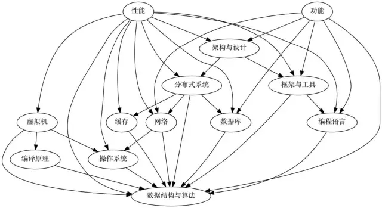

# 程序员简易成长指南：从菜鸟码农到架构师 #

tag:架构师 方法论

[https://mp.weixin.qq.com/s/d7IxsU1nOls3c5j3D8gc0w](https://mp.weixin.qq.com/s/d7IxsU1nOls3c5j3D8gc0w)

>工作了挺久，发现有个挺有意思的现象，从程序员、高级程序员，到现在挂着架构师、专家之类的头衔，伴随着技术和能力的提高，想不明白的事情反而越来越多了。这些疑问有些来自于跟小伙伴交流，有些是我的自问自答，有些到现在也想不清楚，这篇文章就来写一写这些问题。

## 如何更高效地学习？ ##

很多新人程序员一开始在学习上**找不到方向**，但我想在渡过了一段时间的新手期之后这类问题大多都会变得不再那么明显，工作的方向也会逐渐变得清晰起来。

但是没过多久，能了解到的资料就开始超过每天学习的能力，像是买了没看的书、收藏没读的贴、mark了之后再也没有关注过的文章越积越多，更别提每天面对各种技术分享或者微博里的新鲜玩意了。

大多数人每天能留给自己学习的时间有限，这个阶段如何提升学习效率就成了要解决的重点。

说说自己提升学习效率的心得，其实非常简单：**体系化的学习**。

我曾经很喜欢看一些博客或者是一些“看起来”比较通俗易懂的文章，每天在微博微信里刷到什么技术文章就mark下来，基本上几分钟就能读完。可一段时间下来，虽然读了不少东西，但是还是有种在原地打转的状态，并没有感受到有什么实际的提高。

最后实在忍不住，抱着厚书硬啃了一遍，突然有种豁然开朗的感觉：读书时自己学到的是一张完整的知识网络，每个知识点和其它内容相互联系和区别。这种全方位的理解比起一篇篇独立的文章，不知要高到哪里去了。

而读了一段时间书之后，渐渐原本不在一个体系之内的知识也会慢慢联系起来，比如说后端服务的开发，简单梳理一下，就成了这样：

在重复了几次痛苦的学习-梳理过程后，再去看一些独立的文章或者资料往往会事半功倍，因为能在体系内找到相对应的知识，甚至有时候一本书里一页只需要看一句话，点破那层窗户纸，就可以掌握新的知识。

## 你是怎么知道这些的？ ##

工作中总是会遇到各种各样的问题，有几次把问题处理过程总结了一下，发了出来，之后就像滚雪球一样，有越来越多的小伙伴来咨询问题，比如说：

- 前一阵帮忙排查一个性能问题，系统压力稍微一大就会频繁Full GC，压力降低之后又恢复了。

- 某个小伙伴接入代码质量检查系统之后发现每次构建会报一个莫名其妙的错误，打不了包。

- 某次代码有bug，小伙伴跑来来问我git怎么才能回滚代码。 

每次查完这种问题的时候，一些刚毕业没多久小伙伴们就会用一种崇拜的眼神看着我，然后大多会问：“你是怎么知道这些的？”

实际上，虽然我一直在不断的学习，但是面对工作中无穷无尽的新问题，大部分问题还是会命中我没有掌握的那部分区域。每次有人问到我不了解的知识时我都会非常开心：**还有什么比带着问题学习更有效率的学习方法呢**？

而且幸运的是，在建立了自己的知识体系的基础上，学习新的知识通常都能很快的上手，解决一个问题往往只需要多了解一个知识点而已。

举个例子，频繁Full GC的问题，以前查过很多次GC的问题，大多数是Java程序或JVM内存泄露问题，而这次内存没有泄露，GC吞吐量也正常，那么我只需要查一下如何查看一段时间内创建的最多的对象的方法就可以了。

回到刚才的问题，小伙伴们问我：“你是怎么学到这些的知识的？”

答案是：**在你问我问题之后现学的**。

## 架构师应不应该写代码？ ##

似乎隔三差五就能看到一些关于架构师应不应该写代码的文章。我是属于写代码派，因为我本身就喜欢写代码。但是，当工作职责发生变化之后，如何保持写代码和其它工作之间的平衡就成了问题。

从个体效率上来看，我自己亲自写代码，和很多人相比没有什么绝对优势，甚至有些人码代码的速度比我还快一些。

但作为架构师，参与写代码还是会有一些不大不小的收益。

一般来说合格的程序员对于明确分配的任务会完成的很好，但是大部分情况下“架构”这个词意味着架构师并不会涉及太多细节，架构图和代码实现之间总还是有些距离，你无法保证所有人都会正确的理解你的设计，或者是程序员写代码时遇到障碍时会立刻想出足够优雅的解决方案。

之前写过一篇关于烂代码的文章 ，大部分烂代码并不是架构师的设计问题，如果程序员没能很好的理解设计或者是经验不足，往往会做出一些非常匪夷所思的东西。比如我见过刚毕业的程序员为了防止模块耦合而将耦合的代码又拷贝了一份，或者为了“优化性能”而尽量把所有逻辑写在一个函数里。

如果不能及时发现并改正这些问题，那么这些地方就会变成“正确的错误代码”，或者”不是我写的“代码，或者”我靠我也看过那段代码“之类足以被挂上耻辱柱的玩意。这种问题算是架构师的责任吗？作为一个视名声如命的架构师，我认为是的。

在我看来，写代码的架构师更像是在做后勤保障的工作：在代码中第一时间发现可能存在的问题，向其他人提出警告，或是给予其他人改进的意见，必要的时候或是给其他人演示一下正确的姿势。

大部分情况下我作为架构师并不需要揽下“核心模块”开发这种工作，毕竟我能调配的时间太零散了，效率难以保证，很多人在专注的情况下比我做的好很多，我只需要保持大局观需要适度参与就可以了。

总的来说，架构师和程序员在某些方面上有点像产品经理和用户的关系，大部分程序员并不会主动告诉你他们想要什么、哪里需要优化，甚至自己也不知道这些。**想要做出好的产品，捷径之一就是跟用户做同样的事情**。

## 实践：开会是个技术活吗？ ##

我觉得应该没有人喜欢开会，身为一个程序员，没有几个人的志向是当什么职场交际花。

但是会议邀请就这么一个个的跳了出来：开发需求要跟产品开会、项目方案要跟技术开会、新人转正要去开评审会、别的公司来了几个大牛正在开分享会、出了故障要开总结会、小组有周会、部门有周会，大项目每周开两次碰头会不过分吧？小项目启动的时候开个会不过分吧？调试的时候发现有个坑大家赶紧讨论讨论吧？

有时候参加的会议整场下来跟我毛关系都没有，全程神游俩钟头，最后突然有人一拍桌子：”还有问题没？好，散了！“

也有可能有个什么会没叫你，过了俩礼拜突然收到封邮件催开发进度，”当时那个会你没参加，大家都说应该是你们做……你没看会议纪要吗？“

吐槽了这么多，但我还是认为开会是个技术活，对于架构师来说尤其如此。

大多数技术人员开会并不是那种新闻里的工作汇报或者长者们的会议，他们真的需要通过开会讨论一个具体方案，或者解决什么具体问题。可惜的是我参加过很多会议，**大多数的会议都是在毫无意义的交流中浪费时间**：几方人坐在一个屋里互相说一些对方理解不了的话，最后得出一个”我们会后再捋一捋“之类的结论。

这并不是会议才有的问题，在程序员日常的沟通中，也有很多人并不懂得如何交流，比如偶尔会收到一些写的非常认真的邮件，打开之后是密密麻麻的一屏幕文字，但是从第一句开始就不知道他在说什么，后面的东西连看的动力都没有了。

大多数时候，沟通的核心不是你说了什么，而是你想要让对方了解什么、让他做什么。良好的沟通能在工作中显著提升效率，但很多人忽略了这个事情。

想要恰到好处的进行沟通是一件不那么轻松的事情，但是简单来说有几条原则：

1. **确保各方对背景的理解一致**，比如开会之前先简单通过邮件交流一下，对新加入会议的人花个30秒钟做个前情提要，或者在讨论过程中让对方说一下他的理解。

2. **去掉对方不能/不需要理解的内容**，比如跟产品说“这个队列在高并发下因为锁的实现有问题导致CPU性能瓶颈”不如改成“我们发现了性能问题，持续10分钟了，10万用户收不到运营发的无节操广告，大概5分钟后扩容解决”。

3. **确保在对方失去注意力前尽快说出重点**，比如排查问题的总结邮件，如果第一段是这样：“某某框架内部使用的是xxx技术，这个技术的架构是这样：blabla”，那么对方可能完全不知道你在讲什么。可以换成这样：“我发现了某某框架的bug，需要尽快升级，否则在xxx情况下有可能会出现yyy问题，具体排查过程如下：blabla”。

4. **不要说没有意义的内容浪费其他人的时间**，比如”这需求做不了“或者”这里不可能出bug“，没有人想听到这些废话。

## 为什么别人的系统总是那么烂？ ##

很多程序员解决问题的能力很强，说要解决一个什么问题，下午就能写出几百行代码把功能实现了。但是做出来的东西有种少考虑了什么东西的感觉，我花了挺久去想一个词去形容“这个东西”，最后想出了个勉强可以表达的词：程序的生命力。

大部分程序都能实现功能，但是如果把“时间”这个也作为一个考虑的维度的话，就会意识到一个合格的项目需要考虑更多的东西：更通用的使用方式、易于理解的文档、简单而易于扩展的设计，等等。而想要毁掉程序的生命力也很简单：做的更复杂，更定制化，让更少的人参与。

我跟很多程序员提过程序的生命力，比如说要让自己写的工具的操作方式跟其它Linux命令类似，或者要用一些更容易理解但不是性能最优的设计方式，又或者要他去参考现在业界主流的做法，很多人认为提这种需求的意义不大，我觉得这里还是举个例子吧。

很多公司应该都会有一些遗留系统，它们庞大、笨重、难用、几乎无法维护，所有人都在抱怨这些系统，并且每天都在想方设法换掉那些遗留系统。但是一段时间过去之后，又会发现身边的新人又开始吐槽当时替代遗留系统的那个系统了。

“**大多数系统当初都很好使，功能当时够用，扩展性看起来也可以，但是这些系统都是开发的人离职之后变坏的**。”

## 还有更好的办法吗？ ##

成为技术专家之后的工作可以说是痛并快乐着，会有很多人找你咨询问题，另一方面，会有太多人找你咨询问题。

甚至有一段时间我每天的工作就是解答问题，小到工具使用中到疑难bug，大到架构设计，从早上到晚上基本都是在给各种各样的小伙伴提供咨询服务。

我很快发现有些地方不对头：有些问题实在是太简单了，以至于我甚至都不用思考就可以给出答案，为什么会有这种问题？

后来我在每次回答之前先问一句：

>“你还有更好的办法吗？”

一小部分人立刻能给出优化后的版本，甚至我连续问几次之后，他能给出好几个优化后的版本；另小一部分人会斩钉截铁的说优化不了了，就这样了。但是大部分人会犹犹豫豫的说出一些完全不着调的回答。

后来我改成在每次回答之前先问两句：

>“你要解决什么问题?”

>“还有更好的办法吗？”

效果好了很多，很多小伙伴发现要解决的问题并不复杂，只是做法跑偏了。

再后来我改成了在每次回答之前先问三句：

>“他们要你解决什么问题？”

>“你解决的是什么问题？“

>”还有更好的办法吗？“

现在第三句已经很少问到了。

## 成为架构师最困难的门槛是？ ##

跟一些程序员交流的过程中，有不少人问我要怎么成为一名牛逼的架构师。

我最近几年面试的人挺多，发现一个有意思的现象：很多人自称架构师的人跟你讲一个架构时简直滔滔不绝，各种技术名词像是说相声一样从他嘴里说出来，**三句话不离高并发大数据，但是稍微追问一下，就会发现很多基本概念的缺失**。

例如自称精通高并发的人说不清楚他所谓的高并发系统的瓶颈在哪里，自称精通架构设计的人说不明白他的系统怎么保证高可用，自称超大数据量的系统实际上只有不到100万条数据，等等。

架构师虽然听起来很高大上，但本质上仍然是工程师，不是科学家，也不是忽悠人的江湖骗子。学习再多，也需要实践落地。设计架构方案更多的是在做一些抽象和权衡：把复杂的需求抽象成简单的模型，从功能、性能、可用性、研发成本等等方面规划如何构建一个系统，这些内容需要更多的实践练习。

很多人没有工作在类似微博平台这种天天需要接触架构设计的地方，而很多公司没有架构方面的工作可供他们练级，于是就想办法从理论上下功夫，这类人的特征非常明显：在信息不足，甚至不了解实际场景的情况下就开始做架构设计，这种所谓的架构往往理解比较肤浅，经不住推敲。

每年招人之后我们都会做一些针对新人的架构方面的培训，课程材料基本上包括了高可用架构相关的主要方面，但是学完这些材料之后就能成为独当一面的架构师了吗？并没有。相反，这仅仅是开始，新人真正做了几个并发量上万的系统之后才算是正式入门：面对压力时才会懂得权衡，走过弯路之后才会寻找捷径。

所以我认为在架构师（和其它很多）的工作中最重要的部分是实践，夸夸其谈很容易，与其拽一些技术名词，不如把你正在做的系统真正的做好。

## 我和大牛之间有多少距离？ ##

跟很多人一样，刚毕业时我觉得作为程序员，只要努力，加上少许天赋便可以获得一些成绩。

工作一段时间后，对自己和其他人的认识也越来越清晰，逐渐的发现**程序员之间的差距或许比人和猴子之间的差距还大**，接受这个事实这让我郁闷了很久。

再过一段时间，发现自己已经能够客观的评价自己的能力，也意识到了距离并不是那么重要，只要想办法跑的更快，就足够了。

