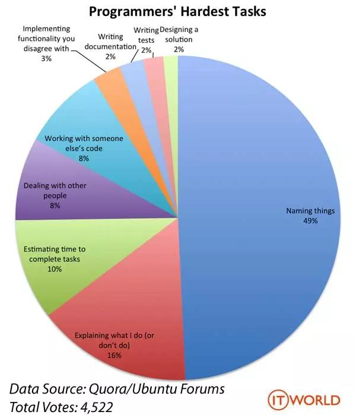

# 赐个好名给函数吧 #

[原文出处](https://mp.weixin.qq.com/s/8VoDQA4SBhkULLzEnpODgw)

早在2013年，国外有个程序员做了一个有意思的投票统计，该投票是让程序员从以下几个选项中选出平时在工作中自己认为最难做的事情：

1. 做项目方案设计
2. 编写测试用例
3. 撰写设计文档
4. 向别人解释我们在做什么事情
5. 实现你不认同的feature
6. 在别人写的代码基础上做改造
7. 与人沟通
8. 给函数、变量命名
9. 进行工作量估时

也许在大家的印象中，**撰写设计文档**和**在别人写的代码基础上做改造**应该是最难的事情。但是最终的投票结果确让大家意想不到，这次投票一起有4522名程序员参与了投票，排在第一位的是**给函数、变量命名**：

大概一半的人投票给了**给函数、变量命名**，从这次投票结果我们足可以看出：给函数、变量命名虽然是一件再普通不过的事情，但是要想把这件事做好绝非易事。那么今天，我们就来聊一聊如何给函数取一个好的名字。

## 一. 常见函数命名风格 ##

目前来说，最常见的函数命名主要有两种风格：**驼峰命名**和**帕斯卡命名**。

**驼峰命名**：多个单词组成一个名称时，第一个单词全部小写，后面单词首字母大写；如：

	public void setUserName(String userName);

**帕斯卡命名**：多个单词组成一个名称时，每个单词的首字母大写；

	public void SetUserName(String userName);

两种命名风格都是ok的，但要保证一点，对于一个团队或者一个项目，需要根据语言本身的推荐命名方式做好约定。比如java一般都采取驼峰命名，C#采取帕斯卡命名。

## 二. 函数命名最高境界 ##

我们通常说：天下武功，唯快不破。那么对于函数命名来说最高境界是什么呢？我认为是：**见字如面，顾名思义**，就是看到函数的名字就知道这个函数具体做了哪些事情。

比如上面的函数：

	public void setUserName(String userName);

但是下面这个函数命名就不是一个好的命名：

	public String addCharacter(String originString, char ch);

这个函数，一咋看，还不错，从函数字面意思看是给某个字符串添加一个字符。**但是到底是在原有字符串首部添加，还是在原有字符串末尾追加呢？亦或是在某个固定位置插入呢？**从函数名字完全看不出来这个函数的真正意图，只能继续往下读这个函数的具体实现才知道。

而下面这几个名字就比上面要好得多：

	public String appendCharacter(String originString, char ch);     // 追加到末尾

	public String insertCharacter(String originString, char ch, int insertPosition); // 插入指定位置

## 三. 函数命名最佳实践 ##

### 要领1：动词选取要精准 ###

通常来说，动词决定了一个函数要采取什么"动作"。动词取的好，一个函数名字已经成功了80%。

常用动词表：

类别|单词
---|---
添加/插入/创建/初始化/加载|add、append、insert、create、initialize、load
删除/销毁|delete、remove、destroy、drop
打开/开始/启动|open、start
关闭/停止|close、stop
获取/读取/查找/查询|get、fetch、acquire、read、search、find、query
设置/重置/放入/写入/释放/刷新|set、reset、put、write、release、refresh
发送/推送|send、push
接收/拉取|receive、pull
提交/撤销/取消|submit、cancel
收集/采集/选取/选择|collect、pick、select
提取/解析|sub、extract、parse
编码/解码|encode、decode
填充/打包/压缩|fill、pack、compress
清空/拆包/解压|flush、clear、unpack、decompress
增加/减少|increase、decrease、reduce
分隔/拼接|split、join、concat
过滤/校验/检测|filter、valid、check

### 要领2：名词使用领域词汇 ###

动词决定了函数的具体动作，而名词决定了函数具体的操作对象，对于名词，尽量使用领域词汇，不要使用生僻或者大家很少使用的词语。

举个例子：集合的容量通常用capacity、集合实际元素个数用size、字符串长度用length，这种就遵循大家的使用习惯，不要用size去形如字符串的长度。

再比如，假如使用到建造者模式，那么通常会用build作为函数名字，这个时候就不要另辟蹊径，用create来作为函数名字，使用大家约定俗成的命名习惯更容易让你的代码被别人读懂。

类别|单词
---|---
容量/大小/长度|capacity、size、length
实例/上下文|instance、context
配置|config、settings
头部/前面/前一个/第一个|header、front、previous、first
尾部/后面/后一个/最后一个|tail、back、next、last
区间/区域/某一部分/范围/规模|range、interval、region、area、section、scope、scale
缓存/缓冲/会话|cache、buffer、session
本地/局部/全局|local、global
成员/元素|member、element
菜单/列表|menu、list
源/目标|source、destination、target

### 要领3：函数取名最忌讳"名不副实" ###

函数取名最忌讳的是"名不副实"，举个例子，假如有个Cache类，里面有个函数判断key是否过期：

	public boolean isExpired(String key) {
        // 当前时间戳
        long curTimestamp = DateUtils.nowUnixTime();
        // 获取key的存入时间戳
        long storeTimestamp = getStoreTimestamp(key);
       
        if (curTimestamp - storeTimestamp > MAX_EXPIRE_SECONDS) {
            // 注意这个地方的delete是个隐藏逻辑
            delete(key);
            return true;
        }
        return false;
	 }

上面这个函数从函数字面意思看是判断key是否过期，但是！！**它居然在函数里面隐藏了一段特殊逻辑：如果过期则删除掉key。**这个就是典型的"名不副实"，这个是最忌讳的，会给后续的开发人员留下"巨坑"。

有两种方式去优化这段代码

- 方式一：将隐藏逻辑去掉

	public boolean isExpired(String key) {
        // 当前时间戳
        long curTimestamp = DateUtils.nowUnixTime();
        // 获取key的存入时间戳
        long storeTimestamp = getStoreTimestamp(key);
       
        if (curTimestamp - storeTimestamp > MAX_EXPIRE_SECONDS) {
            return true;
        }
        return false;
	 }

- 方式二：改变函数名字

	public int deleteIfExpired(String key) {
	    // 当前时间戳
	    long curTimestamp = DateUtils.nowUnixTime();
	    // 获取key的存入时间戳
	    long storeTimestamp = getStoreTimestamp(key);
	   
	    if (curTimestamp - storeTimestamp > MAX_EXPIRE_SECONDS) {
	        return delete(key);
	    }
	    return 0;
	 }

### 要领4：多查询条件的函数名字谨慎使用介词by ###

我们平时在写查询接口时，假如有多个查询参数怎么办？每个通过by一起连接依赖？No！这绝对不是明智的方式。假如一开始产品的需求是通过学生姓名查询学生信息，写出来的可能是这样的函数：

	public List<Student> getByName(String name);

然后突然又有一天产品提出了新的需求，希望同时可以通过姓名和电话号码来查询学生信息，那么函数可能变成这样了：

	public List<Student> getByNameAndMobile(String name, String mobile);

接着，没过多久，产品又希望根据学生年龄来查询学生信息，那么函数可能变成这样了：

	public List<Student> getByNameAndMobileAndAge(String name, String mobile, int age);

如果这样来给函数命名，那么你的噩梦大门即将打开。

通常比较好的做法是：

如果是通过主键id来查询，那么可以通过by来连接查询信息，比如：

	public Student getByStudentId(long studentId);

如果是通过其他属性来查询，并且未来会存在多个组合查询的可能性，建议进行封装，比如：

	public List<Student> getStudents(StudentSearchParam searchParam);

## 小结 ##

最后，建议大家平时在写代码过程中，不要怕在函数命名上耗费时间，一个好的函数命名在后期会大大减少你代码重构的成本，争取对函数命名做到"见字如面"。

