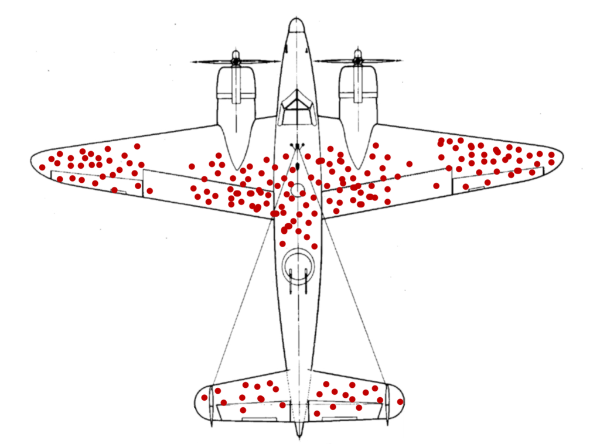
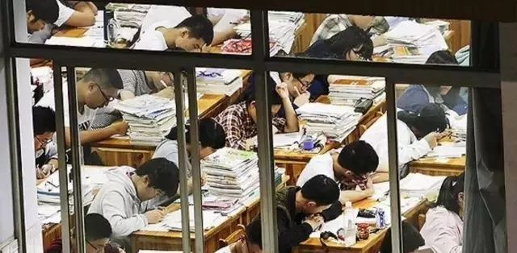

# 幸存者偏差，那些成功学不会告诉你的事 #

[本文转自此处](http://www.sohu.com/a/244672999_782051)

我们很多时候，容易做错一件事。

**就是把好的事情想得盲目乐观，而把不好的事情理解得过分悲观。**

人们都是这样，在一些自己不清楚的行业或领域，只会看到好的事情，然后对这个行业或领域乐观的过了头，在本该全身而退的时候，杀红了眼一般坚持。

但在对待一些不好的事情时，却忽略了客观事实把它们想的万劫不复。

**这种现象，我们把它叫做“幸存者偏差”。**

## 1 ##

死人不会说话

“幸存者偏差”其实是驳斥因一叶障目而产生的一些完全毫无道理的言论。

因为很多言论的产生，只看到了结果，而忽略了过程。

**最初它来源于[战争](https://en.wikipedia.org/wiki/Survivorship_bias#In_the_military)。**

人们发现飞机损伤最严重的地方在于机翼，有的几乎被打成筛子，而发动机和驾驶舱几乎没有损伤。

就在所有人都认为应该给机翼加固装甲时，一个统计学家却认为，应该加固发动机和驾驶舱，因为机翼被打成筛子都可以安全返回，说明它并不脆弱，而驾驶舱和发动机中弹后，飞机都没有飞回来。

**为什么这种现象会叫做“幸存者偏差”？**

因为它是由优胜劣汰之后自然选择出的一个道理：

**死人不会说话。**

飞回来的飞机，都是驾驶舱和发动机完好，死去的战士自然不会告诉他们发动机和驾驶舱才是最重要的，所以人们会自然而然的认为这些地方不重要。

为什么飞机这么容易发生空难？

因为没有发生空难的飞机不会有人报道。你可知道飞机的事故率约在三百万份之一？

为什么好莱坞拍的都是大片？因为拍烂的电影根本没有机会在国内上映，

**你根本没机会看见。**

你可知道好莱坞每年大约有2000-3000部人们所谓的烂片被口诛笔伐？

这些都是“幸存者偏差”，存在于我们的生活之中。

**但今天，我想讲的是另一种幸存者偏差。**

## 2 ##

读书无用？

读书无用论是一个老生常谈的话题。人们常说谁谁谁没上过大学，如今照样挣大钱。

手下全是硕士博士。而好多读书认真用功，考上大学的人，

毕业后反而不如那些没好好学习的人混的好。

这种言论，尤其在前几年媒体报道北大清华出来卖猪肉，种菜之后更甚。

这些其实只是个例，因为基数太大，所以看起来有很多。

2010年第六次全国人口普查显示，大专以上文化程度的人口仅占全国总人口的8.7%左右。

也就是说，高学历者，在我国只有1.1亿左右。

而剩下的近12亿人都是低学历者。

因为人口基数大，所以哪怕成功几率再小，人数也会变得很大。

比如说，高学历者的成功率是10%，低学历者的成功率是1%

那么高学历者成功的人数就是1000万,而低学历者成功的人数是1200万。

所以即便低学历者成功率远低于高学历者，也照样会导致低学历者出现大批成功人士。

对于高学历者，普通人既会关注成功的人，也会关注那些没成功的人，并且高学历却落魄的人尤其受关注，容易被当做新闻报道。

而对于低学历者，普通人往往只关注成功者，忽视了广大学历低又没成功的人。

换句话说，那些低学历者成功之后吹嘘的手下全是硕士博士生员工，

难道不是体现了他对学历的重视吗？

最近某企业HR一条关于“非985的简历一般直接扔掉”的言论刷爆了网络。

该HR说，在招聘会上，一般会收到很多份简历，

会将985学校的简历和非985学校的简历分开存放，

招聘会结束后，将985院校的简历带走，非985的直接扔掉。

这个事情是对是错我们无法评价，

也许你会说非985的学生也有很多学习能力，动手能力，执行力很好的。

但在无人了解的情况下，这些都是没用的，

学历虽然在工作之后不再重要，可找工作的时候，它就是那一块敲门的砖。

所以，你还会觉得读书无用吗？

## 3 ##

**打游戏的前途**

**游戏、直播，是这两年异军突起的行业。**

就是这样目前看似火爆的行业，其实存在着大量的幸存者偏差。

随着互联网的蓬勃发展，电竞行业的前景似乎一片大好，很多比赛的冠军可以拿到几十万上百万甚至上千万的奖金，有越来越多的孩子希望通过游戏改变人生，可抛开天赋，这条路真的会比正常的人生轨迹更加靠谱和容易成功吗？

**我们先来举个例子。**

就拿CCTV每年都会报道的dota2全球邀请赛TI来说。

2017年TI邀请赛总奖金为约2500万美元，其中冠军5人可以分得约1900万美元的奖金，哪怕是第六名也会有100多万美元的奖金。

**这个奖金是不是很诱人？**

是不是足以让每个打游戏的孩子都趋之若鹜？

可是呢，你先听我说。

这是今年TI报名参加预选赛的战队数量，这些只是很多城市，地区最顶尖的玩家数量，并不包括职业战队。

中国区478支队伍

东南亚734支队伍

独联体568支队伍

欧洲384支队伍争

南美洲346支队伍

北美洲145支队伍

2655支战队，1万多人报名，只为了最终正赛的16个名额。

而中国赛区，除了直邀的4支战队以外，剩下的478支战队争夺2支参赛名额。

**好了，到这一步看似几率也不太小。**

1/239，一支战队五名选手，也就是1/1195。

可是你有资格成为这1/1195的分母需要什么？

从全校第一，到全区第一，再到全市第一。

**而这1/1195的数字代表着的是至少全国前五。**

算一算你至少得淘汰掉几十万人，才能有资格变成全国前五吧？

其实还有个最简单的算法，Dota2全球总玩家数量约230万人。而ti冠军只有5人，几率是1/460000。

那些没有进入职业队，或者进入职业队没有获得名气，没有获得名次的选手，80%在被更年轻的选手取代之后，只有找个2000-3000的工作。

所以你还会觉得，打游戏成为职业选手，是一条很不错的出路吗？

对了，目前全国以电子竞技为生的职业选手，已经突破了100万。

而你真正认识叫得上名字的又有几个人？

说真的，国考的录取率1/36比这个高了多少倍？

## 4 ##

**直播比上班强？**

也许你会说，当不了职业选手，我也可以通过直播当职业赚钱。

好的，也许你看到那些直播平台上主播每天无所事事，直播睡觉，吃饭，唱歌，打游戏，都可以月入百万，再不济十万，其实你心里觉得1万都可以。

那我们再看一组数据：

据2016年国内网络主播数据分析，目前中国的网络主播人数已经超过百万，65%的职业主播每天需要直播7-14小时，我们取中间值10个小时，每周就是70个小时。

而普通白领每周的工作时间只有40个小时，还有周末。

先不说每天坐在电脑前7-14个小时，一心向往直播，于是初中，高中肄业便肄业的你，真的认为你的口才和想法足以支撑每天7-14个小时的直播，引得别人一挥千金给你打赏吗？

对了，在所有直播的主播中，只有不到1%的人数，能够年收入百万千万，他们的收入是剩余99%主播收入的总和。

## Last ##

你是不是想起了那条著名的“二八理论”？

20%的人掌握着80%人的资源。

可是你向往的电竞和直播更加的残酷，它只有一九。

以上这些都是很典型的“幸存者偏差”。

媒体也好，人们也好，只愿看见站在塔尖的人，却不想看到这条路曾经埋葬了多少理想和年少。

如今越来越多的成功学，越来越多的名人说，还不都是这样的“幸存者偏差”？

我并不是说那些企业家他们是幸存者，因为成功本来就是一件极小概率的事件，人们对成功的渴望源于其高不可攀的稀缺性，所以才会对他们的鸡汤奉若圭臬。

**但光听道理，是不能成功的。**

道理再简单，你也要有基本的方法论，趁手的工具，和一个清晰的目标。

**别让那些幸存者害了你，这个世界远比你想象的复杂很多。**

