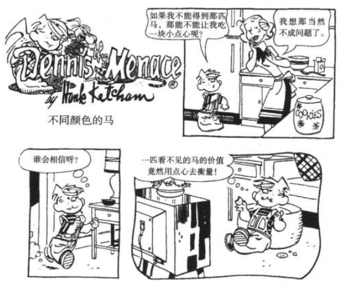

# 索引 #

[影响力武器](#影响力的武器)

[互惠](#互惠)

[承诺和一致](#承诺和一致)

# 影响力的武器 #

>凡事都应该尽可能简单，而不是较为简单——阿尔伯特-爱因斯坦

*人人都爱走捷径，利用该特性进行操控*

事例：错标高价却热卖的绿宝石

事例：只认发叽叽声物体就认为它是它的孩子的雌火鸡

## 按下就播放 ##

**固定行为模式**：大量物种盲目而机械的规律性行为模式 

*习惯*

模式一个基本特点是：每一次，构成模式的所有行为几乎都是按相同的方式、相同顺序发生的。

然而，触发者并不是对手这个整体，而是对手具备的一些特征（如，特殊蓝色羽毛，特殊叫声）。

人类和低等动物的这种自动性，尽管存在若干个重要的相似之处，但有明显区别。人类的自动行为模式大多不是天生的，而是后天习得的，它比低等动物连执行步骤都是固定的模式更为灵活，并可对大量触发情景作出反应。

---

哈佛社会心理学家 Ellen Langer 通过给一个实验——提供一个理由能够增大允许插队，提前用打印机 成功概率，揭示了人类与动物相似的自动反应模式。

**我们在要别人帮忙的时候，要是能给一个理由，成功的概率会更大**

---

**事例**：错标高价却热卖的绿宝石

**一分钱一分货，价格贵就等于东西好。**

---

事实上，模式化的自动行为在大部分人类活动中是相当普遍的，因为很多时候，它是最有效的行为方式。

**你我生活在一个极端复杂的环境中，为了对付它，我们需要捷径。**

哪怕就是短短一天当中遇到的每一人与事，我们也不可能把相关的方方面面都辨识出来，分析出来。因为我们没有足够的时间、精力和能力。

相反，**我们必须频繁地利用我们的范式、经验，根据少数关键特征把事情分类，一碰到这样那样的触发特征，就不假思索地作出反应。**

有时候，人的行为并不适合所处的情境，因为即便是最准确的范式和触发特征都不可能回回管用。

我们容忍这样的不完美，实在是因为并没有其他的选择。

没有了这些特征，我们只能傻站立着——慢慢分类、鉴别和校准——本该采取行动的时机飞逝而过。

种种迹象表明，将来我们会更严重地依赖这些典型范式。

**充斥在我们生活里的刺激会更为复杂、变数更大，我们必然要越来越多地依赖捷径来应对、解决它们。**

>文明的进步，就是人们在不假思索中可以做的事情越来越多。—— Alfred North Whitehead 英国哲学家

---

**事例**：消费者使用商家印刷错误的优惠券

## 渔利的奸商 ##

**我们务必要清晰意识到：要碰到晓得 自动行为模式 奥妙的人，我们可就门户大开、任其摆布了。**

有一种通常叫做“拟态体”的生物会模仿其他动物的触发特征，此时，拟态体便抓住机会，利用对方的错误行为，达到自己的目的。

**事例**：雌萤火虫通过模仿闪光求偶信号诱杀不同类雄萤火虫

**事例**：鲇鱼模仿清洁工小鱼侵害被清洁的大鱼

**事例**：隐翅虫——一种奶妈杀手

---

我们下意识的反应通常是从一些后天学到的心理学原理或公式中得来的。

虽然这些原理的作用有大有小，但其中一些对人类行为的指导作用是十分明显的。我们从很早开始就受到这些原理的影响，**而且自那时起就一直受到它们的摆布**，以至于我们难以察觉到它们的力量。

**但在另外一些人看来，这些原理不仅看得见、摸得着，而且都是现成的，是能够自动影响他人的武器。**

有一些人清楚地指导影响力的武器藏在哪里，而且经常熟练地驾驭这些武器来达到自己的目的。

他们在社会上闯荡，恨不得让每一个人都按照他们的意愿行事，而且他们总是能够如愿以偿。

**其实，他们成功的秘密就在于他们知道怎样提出请求，知道怎样利用身边存在的这样或那样的影响力的武器来武装自己**。有时候仅需要正确选择一个词汇可以做到这一点。

但这个词汇必须要与强大的心理学原理相关，并且能够将自动播放的磁带放置于我们体内。相信人们很快就知道怎样从他人对这些原理的机械反应中捞到好处。

事例：利用“贵=好”自动行为模式的扯猫尾的西装店两兄弟

## 以柔克刚 ##

影响力的武器大多都拥有一些相同的要素：

1. 这类武器有能力激活一种近乎机械化的过程
2. 只要掌握了触发这种过程的能力，人们就能从中渔利
3. 使用者能借助这些自动影响力武器的威力，让人乖乖就范 * 这跟第二条雷同 *

例如：对比原理

**事例**：看过一堆面向姣好面孔的人后，对相貌平平的面孔兴趣不大

**事例**：冷水，温水，热水

**事例**：服装店店员依据价格从高到低向顾客展现，让价格低的商品看起来没有那么贵。

**事例**：汽车经销商跟客户谈妥一辆车价格，再一一报上备选配件

# 互惠 #

>每一笔债都还的干干净净,就好像上帝他老人家是债主——爱默生

互惠原理——要是人家给了我们什么好处，我们应当回报。

>正是因为有了互惠体系，人类才成为人类——考古学家理查德-李基

**事例**：埃塞俄比亚，墨西哥——患难之交。

## 互惠原理如何起作用 ##

人类社会从互惠原理中得到一项重大的竞争优势，由此，它们必须要保证社会成员全都被同化，遵守并信任这一原理。

我们每个人从小听人教导，不能辜负它，众人皆知，违背者，必受社会的制裁和嘲笑。由于普通人大多讨厌一味索取、从不回报的家伙，我们往往会想方设法避免被别人看成揩油鬼、忘恩负义的王八蛋，或是不劳而获的懒虫。但这样一来，我们的煞费苦心又容易遭到那些一开始就想从这种知恩图报的做法中谋取好处的人利用。

**事例**：心理学家丹尼斯-里根 “艺术鉴赏”实验 欣赏画作时，赠人可乐，事后请求帮忙买彩票，对比试验后，赠人可乐帮买彩票的成功率高。

## 互惠原理所向披靡 ##

互惠原理能用作获取他人顺从的有效策略，原因之一在于它的效力实在太强。有些要求，要是没有亏欠感，本来是一定会遭到拒绝的；可靠着互惠原理。你很容易让别人点头答应

**事例**：克氏协会赠予小礼品，然后请求捐款

**事例**：民选官员“互投赞成票”，互相施以小恩小惠

**事例**：一方面，企业和个人愿意向司法和立法官员赠送礼物，施加恩惠。另一方面，国家又制定一系列法律，禁止官员接受此类的礼物和恩惠

**事例**：安利“臭虫”销售策略——先让产品免费使用，试用期过后，试着拿客户希望购买的产品订单。

**事例**：一战德国士兵释放赠予他面包的敌人（这德国佬该有多饿）

**事例**：拒绝邪教食物，避免被摆布

## 互惠原理适用于强加的恩惠 ##

**一个人靠着硬塞给我们一些好处，就能触发我们的亏欠感**

**事例**：心理学家丹尼斯-里根 “艺术鉴赏”实验 **迫于隐形的压力（人家花了钱，不好意思拒绝）接受可乐**

**事例**：克会鲜花隐式要挟捐赠

**事例**：慈善机构寄来的信，附带一些小礼品

## 互惠原理可触发不对等交换 ##

**事例**：心理学家丹尼斯-里根 “艺术鉴赏”实验 **可乐花费，和抽奖券的收益，平均一下，还是有赚**

为什么最初的小小善举往往刺激人们回报以大得多的恩惠？

- 亏欠感让人觉得不舒服
- 违背互惠原理，接受而不试图回报他人善举的人，是不受社会群体欢迎的

**事例**：酒吧请女士喝酒，两性双方有可能发生深度体液交换

## 互惠式让步 ##

**事例**：童子军男孩的让步推销，先推销5刀马戏门票，被拒后，再推销巧克力棒，结果花2刀买了两根巧克力棒

互惠原理通过**两条途径**来实现相互让步

- 受了对方让步的人以同样的方式回答
- 由于接受了让步的人有回报的义务，人们就乐意率先让步，从而启动有益的交换过程

由于互惠原理决定了妥协过程，你可把率先让步当成一种高度有效的顺从技巧使用。

这称“**拒绝——后撤**”术，也叫“**留面子**”法。

假设你想让我答应你的某个请求，为了提高获胜的概率，你可向我提一个大些的要求——对这样要求以后，你再提出一个稍小的要求，这个要求才是你真正的目标。

倘若你的要求设置巧妙，我会把你的第二个要求看成是一种对我的让步，并有可能感到自己这边也应该让让步，于是就顺从了你的第二个要求。

**事例**：提出陪少年犯一天动物园，拒绝率8成。若提出为期两年，每星期花两小时陪少年犯的极端要求，等被拒后，再提出陪少年犯一天动物园，成功率翻了3倍。

**事例**：剧本审核——愿意是使用必被删小尺度台词，但是故意使用大尺度台词，原先小尺度台词的反而没删。

**事例**：向客户推销一个产品，被拒后，要求推荐名单。是熟人推荐后，推销成功率会有大幅提高

先提大要求后提小要求，另外**两个原因**

- 知觉对比原理。来自前一章的内容
- 请求顺序上的安排。先大后小

**拒绝——后撤**手法的**缺点**：

1. 受害者可能会**否认**跟请求者达成的口头协议
2. 受害者可能会对操控自己的请求者产生怀疑，并决定永远不再跟此人打交道

然而，采用拒绝——后撤手法时，上述的受害反应的发生频率并未增加，甚至降低。

**拒绝——后撤手法似乎不光刺激人们答应请求，还鼓励他们切身实践承诺，甚至叫他们自愿履行进一步的要求。**

让步举动有一项鲜有人知的积极副作用：对方会对这种安排滋生更大的**责任感**和**满意感**。

## 如何拒绝 ##

倘若别人的提议我们确实赞同，那就不妨接受他；倘若这一提议别有所图，那我们就置之不理。

善意自然应当以善意回报，可对销售策略却没这个必要。

**事例**：购机后先推荐三年质保，被拒后再推一年质保成功率，比直接推一年质保的，更高

# 承诺和一致 #

