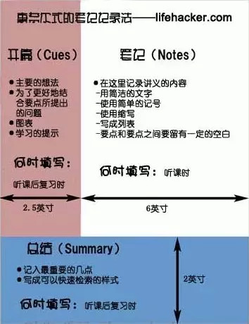

# 康奈尔笔记法 #

creation date:2019-02-17 13: 49: 05

tag:日常技能

[https://weibo.com/p/1001603849959135908767](https://weibo.com/p/1001603849959135908767)

## 5R笔记法 ##

5R笔记法，又叫做康奈尔笔记法，是用产生这种笔记法的大学校名命名的。这一方法几乎适用于一切讲授或阅读课，**特别是对于听课笔记**，5R笔记法应是最佳首选。这种方法是记与学，思考与运用相结合的有效方法。具体包括以下几个步骤：

1. 记录（Record）。在听讲或阅读过程中，在主栏（将笔记本的一页分为左大右小两部分，左侧为主栏，右侧为副栏）内尽量多记有意义的论据、概念等讲课内容。

2. 简化（Reduce）。下课以后，尽可能及早将这些论据、概念简明扼要地概括（简化）在回忆栏，即副栏。

3. 背诵（Recite）。把主栏遮住，只用回忆栏中的摘记提示，尽量完满地叙述课堂上讲过的内容。

4. 思考（Reflect）。将自己的听课随感、意见、经验体会之类的内容，与讲课内容区分开，写在卡片或笔记本的某一单独部分，加上标题和索引，编制成提纲、摘要，分成类目。并随时归档。

5. 复习（Review）。每周花十分钟左右时间，快速复习笔记，主要是先看回忆栏，适当看主栏。

这种做笔记的方法初用时，可以以一科为例进行训练。在这一科不断熟练的基础上，然后再用于其他科目。

## 符号记录法 ##

符号记录法就是在课本、参考书原文的旁边加上各种符号，如直线、双线、黑点、圆圈、曲线、箭头、红线、蓝线、三角、方框、着重号、惊叹号、问号等 等，便于找出重点，加深印象，或提出质疑。什么符号代表什么意思，你可以自己掌握，但最好形成一套比较稳定的符号系统。这种方法比较适合于自学笔记和预习 笔记。在操作时你应注意以下一些准则：

1. 读完后再做记号。在你还没有把整个段落或有标题的部分读完并停下来思考之前，不要在课本上做记 号。在阅读的时候，你要分清作者是在讲一个新的概念，还是只是用不同的词语说明同样的概念，你只有等读完这一段落或部分以后，才能回过头来看出那些重复的 内容。这样做可使你不至于抓住那些一眼看上去仿佛很重要的东西。

2. 要非常善于选择。你不要一下子在很多项目下划线或草草写上许多项目，这样会使记忆负担过重，并迫使你同一时刻从几个方面来思考问题，也加重你的思维负担。你要少做些记号，但也不要少得使你在复习时又只好将整页内容通读一遍。

3. 用自己的话。页边空白处简短的笔记应该用你自己的话来写，这是因为自己的话代表你自己的思想，以后这些话会成为这一页所述概念的一些有力的提示。

4. 简洁。在一些虽简短但是有意义的短语下划线，而不要在完整的句子下面划线，页边空白处的笔记要简明扼要。它们会在你的记忆里留下更为深刻的印象。在你背诵和复习的时候用起来更可得心应手。

5. 迅速。你不可能一整天的时间都用来做记号。你先要阅读，再回过头来大略地复习一遍，并迅速做下记号，然后学习这一章的下一部分内容。

6. 整齐。你作的符号要尽量整齐，而不要胡写乱画，否则会影响你以后的复习和应运。当你以后复习的时候，整齐的记号会鼓励你不断学习，并可以节省时间，因为整齐的记号便于你迅速回忆当初学习时的情景，能使你容易而清楚地领悟书中的思想。

## 笔记整理法 ##

由于种种原因，你在课堂上做的笔记往往比较杂乱，课后复习不太好用。为了巩固学习成果，积累复习资料，你需要对笔记进一步整理，使之成为比较系统、条理的参考资料。对课堂笔记进行整理、加工的方法是：

1. 忆。课后即抓紧时间，趁热打铁，对照书本、笔记，及时回忆有关信息。这是你整理笔记的重要前提。

2. 补。课堂上所作的笔记，因为是跟着教师讲课的速度进行的，而讲课速度要比记录速度快一些，所以你的笔记会出现缺漏、跳跃、省略等情况，在忆的基础上，及时作修补，使笔记更完整。

3. 改。仔细审阅你的课堂笔记，对错字、错句及其他不够确切的地方进行修改。

4. 编。用统一的序号，对笔记内容进行提纲式的、逻辑性的排列，注明号码，梳理好整理笔记的先后顺序。

5. 分。以文字（最好用色笔）或符号、代号等划分笔记内容的类别。例如：哪些是字词类，哪些是作家与作品类，哪些作品（或课文）分析类，哪些是问题质疑、探索类，哪些是课后练习题解答等等。

6. 舍。省略无关紧要的笔记内容，使笔记简明扼要。

7. 记。分类抄录经过整理的笔记。同类的知识，摘抄在同一个本子上或一个本子的同一部分，也可以用卡片分类抄录。这样，日后复习、使用就方便了，按需所取，纲目清晰，快捷好用，便于记忆。
