# 目录 #

[一、初级句型——简单句](#)

[基本句型及补语](#基本句型及补语)

[名词短语与冠词](#名词短语与冠词)

[动词时态](#动词时态)

[不定词短语](#不定词短语)

[动名词](#动名词)

[分词](#分词)

[形容词](#形容词)

[副词](#副词)

[语气](#语气)

[介系词](#介系词)

[主语动词一致性](#主语动词一致性)

[二、中级句型——复句、合句](#)

[名词从句](#名词从句)

[副词从句](#副词从句)

[关系从句](#关系从句)

[对等连接词与对等从句](#对等连接词与对等从句)

[三、高级句型——简化从句、倒装句](#)

[从属从句简化的通则](#从属从句简化的通则)

[形容词从句简化](#形容词从句简化)

[名词从句简化](#名词从句简化)

[副词从句简化之一](#副词从句简化之一)

[副词从句简化之二](#副词从句简化之二)

[简化从句](#简化从句)

[倒装句](#倒装句)

# 基本句型及补语 #

## 五种单句的基本类型 ##

1. S + V
2. S + V + O
3. S + V + C
4. S + V + O
5. S + V + O

S:Subject 主语
V:Verb 动词
O:Object 宾语
C:Complement 补语

基本句型分五种，是因为有五种特性不同的动词而造成的。

一个完整的句子，必须能够表达完整的意思，需主语和动词组成。

主语，是句子所叙述的对象。

动词，构成叙述的主要内容。

	S + V

	John died in World War Two.

died 不及物动词 表示该动作可独立发生，不牵涉到别的人或物

	S + V + O

	John killed three enemy soldiers.

kill 及物动词 必须发生在另一种对象的身上(宾语)  

---

**在所有的英语动词中，只有解释为“是”的动词是空的，完全没有意义。**

一般动词，不论及物或不及物，都要担任叙述全句最主要内容工作。

只有解释为“是”的动词，没有叙述能力，只能扮演**引导**叙述部分的内容。

	S + V + C

	John was a soldier.

	John was courageous.

## 不必翻译的动词：be动词 ##

	S + V + C

	You are amazing.

	The soup is too hot.

解释为“是”的动词没有叙述能力，只能把主语和后面构成叙述的部分连接起来，故它又称“**连缀动词Linking Verb**”

跟这动词后面部分，因为替代了动词所扮演叙述角色，补足句子使它获得完整的意思，称之为“**补语Complement**”

## 其它需要补语的动词 ##

感官上的

1. look 看起来是
2. sound
3. feel
4. taste
5. smell

其它

1. seem 似乎是
2. appear 显得是
3. turn 转变为
4. prove 证实为
5. become 成为
6. make 作为

---
	
	助记

	师傅 咸的 装逼 诊室 橙味 座位
	
	似乎 显得 转变 证实 成为 作为

	seem appear turn prove become make

	师傅参加吃咸饼大赛，为了装逼，结果弄得自己

1. The dress looks pretty.
2. The dog seems friendly.
3. His demands appear reasonable.

## 宾语补语的句型 ##

S+V+O+C的句型，补语告诉读者宾语是什么，中间暗示有一个"是"的关系存在

1. I find the dress pretty.
2. They consider his demands reasonable.
3. The food make me sick.

验证 S+V+O+C句型最简便的方法：把宾语和补语拿出来，中间加be动词，看看能不能改成S+V+C

## 补语的词类 ##

1. 形容词
2. 名词

---

	John was a soldier.

	John was courageous.

## 没有补语的be动词 ##

这时的be动词解释为“**存在**”

1. I think; therefore I am.
2. To be or not to be, that is the question.

## 有两个宾语的句型 S+V+O+O ##

- John's father gave him a dog. //S+V+O+O 后两个名词并不相等
- John's father called him a dog. //S+V+O+C 后两个名词并不相等

# 名词短语与冠词 #

## 名词短语 ##

首先，英语是一种拼音文字，和其它拼音文字一样，用词尾的变化来表示单、复数。

不仅如此，在名词短语的开头，还有一些符号来配合标示该名词的范围，这符号称为“限定词Determiners”。

它与词尾的单复数符号互相呼应，共同决定名词的范围。

冠词就是Determiners之中的一种。

	a new book
	many good students
	his beautiful wife
	the best answer
	those sweet roses

a, many, his 等就是限定词

形容词也可省略。

在上下文允许下，可省略名词部分，如

1. Of these answers, the one is the best.
2. I want those.(同时伴随指着一些玫瑰花

## 啥时无需限定词？ ##

从语源学(etymology)的角度来看，**冠词a[n]可视为one一字的弱化(reduction)结果**。

也就是说，a[n]就代表one的意思，只是语气比较弱。

若后面名词不适以“一个”来交代，也就是不适合加a[n]的话，就可把限定定语这个位置空下来

	Unmarried men are a rare species these days.

	a new book

	若只写成new book，变成不完整表示

抽象名词(honesty, bribery)没有具体形状，不能以“一个”来表示。

物质名词(water, food)虽然是具体的东西，可形状不固定，也不能以“一个”来表示。

	Honesty/音ˈɔnɪsti:/ is not necessarily the best policy/音pɔləsi/.

	Fresh water is a precious resource in Saudi Arabia.

## 专有名词与补语位置 ##

人名、地名等都是专有名词。不适合用a[n],-s

**要判定一个名词是否为专有名词，有时并不是那么容易。**

	There are five Sundays this month.
	
	I have an appointment on Sunday.

---

放在补语位置的专有名词最难以判断。

补语和主语(或宾语)之间有同等的关系，如果主语(或宾语)是专有名词(例如人名)的话，那么它的补语既然和它同等，便也会被当作做是专有名词来使用，条件是在补语位置上的名词也必须具有“唯一”的性质。

	Mr.Elson was president of the high school.//president这里是专有名词

	Some say he was a better president than Mr.Robert.//president这里是非专有名词，因为a[n]

---

	Mr.Elson is also a member of the Council of the city.//

	Mattin, Head of the football team, at the time, wore a mustache/音məˈstæʃ/.//Head 专有名词

	Clinton made Gorle campaign/音kæmˈpen/竞选活动 partner of the Presidential/音ˌprɛzɪˈdɛnʃəl/ election.//campaign partner专有名词

## 定冠词the的用法 ##

在语源学上，the可视为that或those的弱化形式。而that或those是指示形容词，有明确的指示作用。

所以定冠词the也可以用同样的角度了解：凡是上下文中有明确或暗示是，也就是有“那个”的指示功能，便要定冠词the。

	I need a book to read on my trip.

	I have finished the book you lent me.

---

	Modern history is my favorite subject.
	
	The history of recent China is a sorry record.

---

	He should be home, I saw a light in his house.//没有特指哪一个灯。

	Turn off the portal light.//有特指的，portal/音ˈpɔ:rtl/入口

---

	I'm going to the office now.//清楚地暗示

	Do you mind if I open the window?//特指一个窗户

	Do you mind if I open a window?//随便打开一个窗户

## 定冠词与专有名词 ##

专有名词定义为：只有一个对象存在的名词，若Taibei,Jiang JieShi等。**专有名词和定冠词是有冲突的、并且不能并存的**。若加the，就表示这东西有两个以上，也就不是专有名词了

	This is not the John Smith I know.//暗指不止有一个John Smith

	This is a photography show of the Taibei 50 years ago.//50年前的台北非现在的台北

---

**大多数语法书写出“专有名词要加定冠词”，列出很多例外，其实不然**

	the Pacific [Ocean] //叫做Pacific的那个洋

	the Atlantic [Ocean]

	the Indian Ocean//不能去掉Ocean，the Indian通常指印度人

	the Mediterranean [Sea]

	the Dead Sea//不能去掉Sea，the Dead通常指死人

[]表示去掉了，也不会影响表达的意思。中间部分，如Pacific，其实具有形容词性质的，

	the Philippine Islands -> the Philippines

	the Alp Mountains -> the Alps

这也不是例外，只是合理的省略方式罢了。

	the Mississippi [River]

	the Titanic [Ship]

	the Hilton [Hotel]

	the United States of America

	the United Nations 联合国

## 小结 ##

1. 名词短语包括 限定词、形容词、名词三个部分。任一部分都可以省略。
2. 若名词短语(抽象名词，不明显度量物品的名词，复数等)中不用限定词，是因为该名词不适合加a[n]
3. a[n]是one的弱化结果，the是that/those的弱化结果。

# 动词时态 #

**以简驭繁的办法是：把be动词当作动词，其后的分词则视为形容词补语**。

## 简单式 ##

简单式的动词可以清楚交代此动作是发生于哪个时代。

而非它搭配的时间副词通常会**明确表示出一个时段**。

简单式的时间是括弧的形状，可用括弧把简单式的时间括起来。

### 一、过去时间 ###

	The U.S. established diplomatric relations with the P.R.C in 1979.

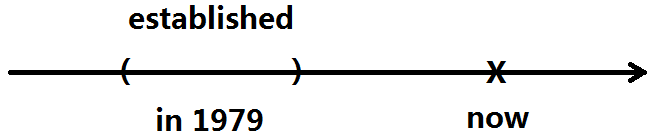

---

**过去分词字尾-ed视为一个表达被动一位的形容词字尾。**

	The movable print was introduced to England in 1485.

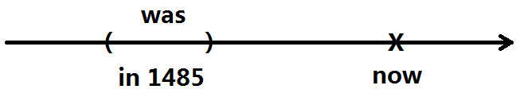

---

现在分词表示一种持续性，相当于中文的“**正在**”、“**一直**”的口吻。

	I was visiting clients the whole day yesterday.

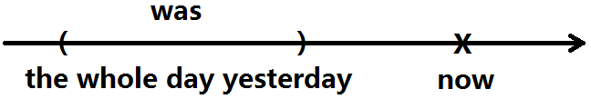

---

	I was watching TV when I heard the doorbell.

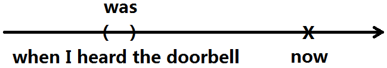

---

	The witness was being questioned in count when he had a heart attack.

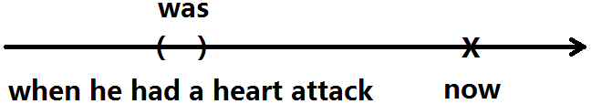

### 二、现在时间 ###

若时间副词是now，或是以now为中心的或大或小的括弧，就要用现在时间的简单式。

只有以now为中心的括弧，可以达到涵盖过去未来，才可以用来表示不变的原理。

	Huang pitch a fast ball.
	Li swing.
	It looks like a hit.
	The shortstop fails to stop it.It's double.

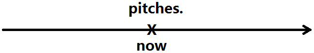

---

	Bush is the U.S. President.

---

	All mothers love their children.

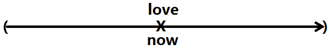

---

	7-ELEVEN is selling big cokes at a discount this month

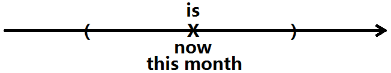

---

	According to the NASA survey, the ozone layer is being depleted. 
	
	survey/ˈsɜ:rveɪ/,depleted/dɪ'plɪtɪd/耗尽，使枯竭

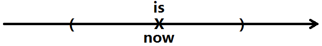

### 三、未来时间 ###

	There will be a major election in March.

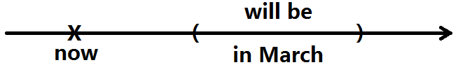

---

	Don't call me at six tomorrow.I'll still be sleeping then.

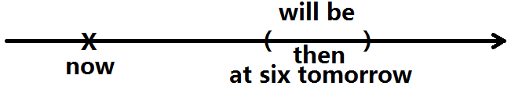

---

	The building will be razed next month.

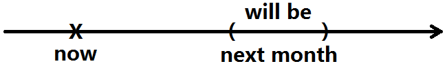

## 完成式 ##

相对于简单式用括弧形状来表达时间，完成式则是以箭头形状来表达时间，**表示动作的截止时间**。

从功能上看来，简单式是交代动作发生的时段，而完成式并不动作发生的时段作明确的交代，只表示“**曾经**”、“**已经**”、“**做过**”的意思

### 一、现在时间 ###

	I'm sure I have seen this face somewhere.

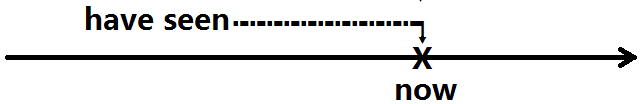

---

	We have been working overtime for a week to fill your order.

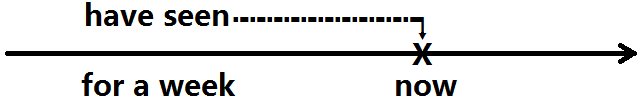

---

	The house has been redecorated twice since they moved in.

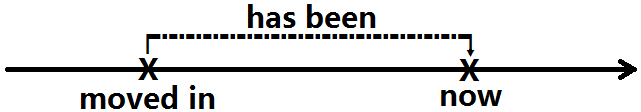

### 二、过去时间 ###

	Many soldiers had died from pneumonia肺炎 before the discovery of penicillin/ˌpɛnɪˈsɪlɪn/.

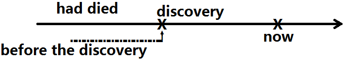

---

	I had been smoking three packs of cigarettes a day before I decided to quit.

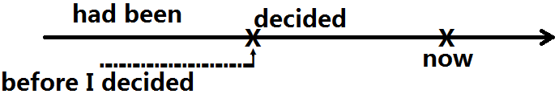

---

	Japan had not been defeated yet by the time Germany surrendered unconditionally.

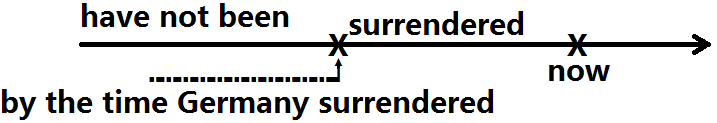

### 三、未来时间 ###

	Next April, I will have worked here for 20 years.

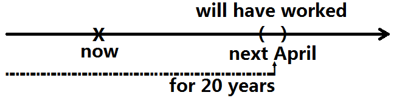

---

	Come back at 5:00. Your car will have been fixed by then.

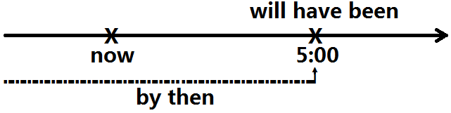

---

	In two more minutes,
	she will have been talking on the phone for three hours.

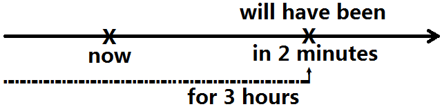

## 小结 ##

1. 把be动词当动词看，句子就只剩两种状态：简单式与完成时
2. 简单式是以括弧型的时间来表达。
3. 完成时是以箭头型的时间来表达，表示动作的截止时间
4. be动词后面的分词当作形容词补语。现在分词有正在进行的意思，过去分词有被动的意思

-|简单式|完成式
---|---|---
过去|-|-
现在|-|-
未来|-|-

# 不定词短语 #

它就是to加上原形动词所形成的短语。

**它最合理的解释就是把它视为助动词的变化**。

## 不定词与助动词的共同点 ##

	I am glad to know you.

	I am glad because I can know you.
	I am glad because I am able to know you.

这里to know，就是 able know，也就是can know的变化。

不定词与助动词的共同点：4点

### 后面都接原形动词 ###

	I will go.
	I want to go.

### 都有不确定的语气 ###

	He is right.
	He may be right.//不确定语气
	He seems to be right.//不确定语气

这种不确定语气是不定词与助动词之间一个很重要的共同点，可用来判断何时该用不定词。

### 都是用完成式来表达相对的过去时间 ###

现在时态

	It must be raining now.

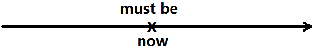

---

未来时态

	It may rain any minute.
	It might even snow.

上面的might并不是may的过去式，只表示比较保留、比较没有把握得猜测语气

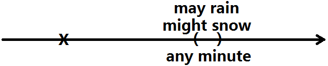

---

助动词本身缺乏表达过去时间的能力，**只好用 完成式 来表示过去**，如：must have rained

	I must have rained last night.

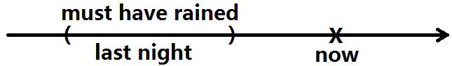

	It seems to have rained last night.

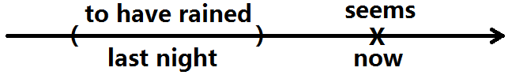

### 所有重要的语气助动词，都可以改写为不定词 ###

1. must - have to
2. should - ought to
3. will/would - be going to
4. can/could - be able to
5. may/might - be likely to

从以上**四点**(**1**.接原形，**2**.不确定语气，**3**.完成时表过去，**4**.一些语气助词可改写成不定词)来看，不定词与助动词其实是同一种东西的相互转化，凡是不定词出现的地方，都可以看成另外一个从句的省略：把主语省略，助动词改为不定词。

1.原形2.不确定3.完成时过去4.语气助动

助记：**原型**机还有很多东西**不确定**但最终**完成**了，他用肯定的**语气**说的

## 不定词与动名词的区分 ##

动状语Verbals/音ˈvɜ:rbl/

1. 现在分词Ving
2. 过去分词Ven
3. 动名词Ving
4. 不定词toV

现在分词、过去分词是形容词类

不定词则是“不一定什么词类”它可以当名词，形容词，副词使用

混淆点：动名词和不定词可当作名词

**ing形式与各名词结合，没有统一的范式**

### plan ###

	They plan to marry next month.

因为to marry next month，就是(that) they will marry next month的变化。marry是计划中的事情，下个月要发生，是未来式。

### avoid ###

	I avoid making the same mistake twice.

making 比 to make恰当，因为to make 是will make 的省略，既然是“避免”，后面又用未来式的涵意will make(将要做)，意思就变得不清楚。

	I will make the same mistake twice.

### hate ###

	I hate to say this, but I think you're mistaken.

hate固然也是否定的意思，可是后面却要to say，是因为to say是I have to say，也就是I must say的变化。表示为“**虽然很不愿意说，可是我不能不说**”。

### like/dislike ###

	I like to be the first.//I can be
	
	I don't like to wait too long.//I will wait.
	
	I dislike standing in long lines.//不像上面那句hate没有have to暗示，用standing

### try ###

	I always try to be on time.//这里try有尝试的不确定性

	Why don't you try being late for a change?
	//用being late而不用to be late，
	是表示“迟到”是一定做到的，至于try所暗示的不确定性，
	现在不在“迟到”一事的本身，而是在“试试看迟到一下的后果会是如何？”---有建议意味

>Notice the difference betweentry to do something and try doing something:
- You should try to eat more fruit.
means 'You should make an effort to eat more fruit.';
- You should try eating more fruit.
means 'You should see if eating more fruit will help you (to feel better, for example).

>from oxford 7th

### remenber ###

	Please remember to give me a wake-up call at 6:00 tomorrow.//未来式，不确定性
	Please remember you must give me a call.

	I remember calling her at 6:00 last night.//确定的事实的语气
	I remember that I called her last night.

### stop ###

	The speaker stopped talking at the second bell.//talking可以视为he was talking的变化，演讲是持续进行的，然后才停止的。

	The speaker stopped a second to drink some water.
	The speaker stopped a second so that he could drink some water.//to drink是he could drink的变化

## 使役动词与原形动词 ##

	The little girl asked her mother to come to the PTA meeting.
	The little girl asked if her mother would come to the PTA meeting.

ask是普通动词，邀请人参加，但别人愿不愿意是不确定的，所以会牵涉到语气助动词would come，这就会变成不定词to come.

使役动词与普通动词的差别就在于它有强制性，它的结果是确定的，无从选择的。因为这种确定性的语气，排除了助动词存在的空间，因而也就不能用不定词。

	The teacher made the little girl stay behind.//命令留下
	The teacher asked the little girl to stay behind.//请求

**像let、have、make等使役动词，后面是接原形动词而不能用不定词。**是因为这种强迫性的命令语气，使它的结果不具有不确定性，因而不能用不定词。

当然并表示使役动词后面只能用原形动词。

John had his car painted over.

## 感官动词与原形动词 ##

	I heard her playing the violin

感官动词see、hear、watch等后不适用不定词。它们的后面不适合用不定词，是因为不定词是助动词的变化，有不确定的语气。

感官动词这种“听到、看到”的字眼，只能配合确实发生的事使用，而不能和带有“不确定、未发生”涵意的不定词连用。

	I heard her cry out in pain.//她喊叫了一声。这里就不能用ing了。

## 小结 ##

不定词是助动词的变化，带有不确定语气

不定词与助动词相似之处：

**1**.接原形，**2**.不确定语气，**3**.完成时表过去，**4**.一些语气助词可改写成不定词

# 动名词 #

## 动名词的特性 ##

### 动名词与普通名词的比较 ###

	Let me buy you a drink.//普通名词
	
	Drinking is his only vice.//

a drink普通名词，Drinking有持续性的暗示，如swimming、dancing等。

	I am not afraid of death, but I am scared of dying.

death代表“死亡”的抽象概念。

若要区分“抽象概念”与“动作过程”，只要一个用普通名词，一个用暗示“动作、持续”的动名词就可以了。

	There are two weddings at the restaurant tonight.

动名词的结构像普通名词，可以

1. 有冠词 如 the burning
2. 所有格 如 his running
3. 有复数 如 two weddings

### 动名词短语与名词从句的比较 ###

	I really enjoyed teaching English to school children at night.

	I really enjoyed that I taught English to school children at night.

主要从句的主语与宾语从句的主语相同，可省略

动名词短语可视为名词从句的变化。只要把主语和be动词放回去，就会出现完整的名词从句。

## 动名词的一些变化 ##

### 复合字 ###

	Picking strawberries can be fun.
	That anybody picks strawberries can be fun.//的简写

	The picking of strawberries requires patience.//名词短语来使用。

	Strawberry-picking is a strenuous/ˈstrɛnjuəs/费力 job.//复合字

### 主语不能省略时的处理方式 ###

主要从句的主语与宾语从句的不同时

	I don't like that John calls my girlfriend day after day.

若换成

	I don't like calling my girlfriend day after day.

就变成自己不爱打电话给女朋友了。

方法使用 **所有格**

	I don't like John's calling my girlfriend day after day.

### 动名词的被动态：Being Ven ###

	That I was invited here is a great honor.

	Being invited here is a great honor.

### 动名词与现在分词的分辨 ###

	The flying bird is a black-faced spoonbill.

尝试将形容移到补语的位置

	The bird is flying//这里做现在分词。

---

	That flying jacket looks smart on you.

尝试将形容移到补语的位置

	The jacket is flying.//这就不合逻辑。

应该是换成这样

	That's a jacket for flying.

## 小结 ##

1. **不定词**是助动词的变化，带有不确定语气。
2. 动名词的结构接近名词，可往往带有“动作，持续”的意思。

# 分词 #

将分词一律视为形容词。

## 分词与形容词的比较 ##

形容词是用来形容名词的，在句中有两种位置：

1. 名词短语中
2. 补语位置

这两个位置皆可放置分词

### 现在分词与形容词的关系 ###

	A barking dog doesn't bite.
	The dog is barking.

barking有正在进行的意味。-ing像其他形容词词尾-less，-ful等有弦外之音。-ing 弦外之音 就是 “正在”，“一直”。

### 过去分词与形容词的关系 ###

	Boiled water is safe to drink.
	The water is boiled.

-ed的弦外之音是被动或完成的暗示，要加上“**被**”，“**已经**”来解释。

但是，-ed往往也不是当作被动来解释，而要解释为“完成”的暗示。

### 带有“完成”暗示而非“被动态”的过去分词 ###

	I can't find my wallet. It's gone.

	The leaves are all fallen, now that winter is here.

	I'm done.It's all yours.

## 现在分词与过去分词的区别 ##

### 表示“感觉”的分词 ###

	He is disappointed at his scores.
	
	His scores are disppointing.

一些表示“感觉”的字，像disappoint、satisfy、surprise、amaze、astonish等。

该用 现在分词 还是 过去分词，有时用中文的“主动”、“被动”一时会想不清楚

把上面两句还原

	His scores disappoint him.

然后将还原句改成被动态。

	He is disappointed at his scores.

因为**感觉**大于**被动**，使用介词at而非by。

	He scores are disappointing.

### 词根词首分析 ###

	Water consist of hydrogen and oxygen.
	
	Water is composed of hydrogen and oxygen.

sist词根有stand和be意思，都是不及物，配合词首con(together)，可解释为stand together或be together。

既然他是不及物动词，自然没有被动态，也没有宾语。

词根pos解释为place(放)，是及物动词，所以可有别动态，才可以用到过去分词composed。

## 现在分词与过去分词混合的形态 ##

	I have no comment to make while the case is being investigated by police.

本句只要把be动词视为动词，being investigated视为两个形容词，“正在”“被调查”。

## 形容词从句简化结果 ##

### Ven ###

	Toys made in Taiwan are much better now.
	Toys which are made in Taiwan are much better now.

### Ving ###

	Children living in orphanages make a lot of friends.

living in orphanages 是 who are living in orphanages的简化

### being Ven ###

	The vase being auctioned now is a Ming china.

being auctioned是which is being auctioned

## 副词从句简化结果 ##

### Ven ###

	Wounded in war, the soldier was sent home.

这个分词短语是After/Because he was wounded in war这个副词从句的简化。

### Ving ###

	The pigeon, after flying 200 miles, was caught up in a net.

after flying 200 miles 是副词从句after it flew 200 miles的省略。

### having Ven ###

	Having finished the day's work, the secretary went home.

Having finished the day's work是副词从句 She had finished the day's work简化的原因还是因为主语相同。

## 小结 ##

动词作形容词用。

把分词当作形容词，有四两拨千斤的作用。

# 形容词 #

大致说来，形容词是可以定义为修饰名词的修饰语。

## 名词短语中的形容词 ##

这种称为**attributive adjectives** 属性形容词

限定词|形容词|名词
---|---|---
three|yellow|roses
a|new|camera
my|best|friend
-|dirty|water
-|pretty|women

### 放在名词后面的形容词 ###

	Someone else will have to do it.
	I don't know anybody else.

else这形容词的用法是配合像someone,anyone等复合名词来使用。

因为限定词的some、any已经和名词的one、body写在一起，所以中间的形容词位置被挤掉了，else这个形容词就只能放到名词后面去了。

a-开头的古英语形容词，除了可以放在补语位置外，如要用在名词短语中，**也只能放在名词后面**

a-的词首代表一种暂时性的状态

	John and his brother alike are unreliable.//John和他兄弟都不可靠
	Money alone cannot solve our problem.//光靠钱解决不了我们的问题。

### 名词转为形容词 ###

限定词|形容词|名词
---|---|---
a|government|store
my|pencil|sharpener
a|cigarette|box
-|movie|theaters

名词转为形容词无需复数

### 复合词形容词 ###

	a five-year-old child
	an eye-opening experience
	a 100-watt light bulb//100瓦的灯泡

## 名词短语中形容词的顺序 ##

**在attribute adjectives之间，越是表达名词属性的形容词越要靠近名词。亦即，越是不可变得，客观的特指越要靠近名词，反之，越是可变的、临时的、主观的因素则越要放得远离名词。**

	The murderer left behind a bloody old black Italian leather glove.

	He's wearing a handsome old brown U.S. Air Force leather flying jacket.

## 形容词在名词短语位置与补语位置的比较 ##

attribute adjectives 名词短语中的形容词

predicative adjectives 补语位置的形容词

补语位置的形容词距离名词最远，惯常用来对名词做一些临时性、补充性的叙述，与表示属性的attribute adjectives在语气上颇不相同。

	John is sick today and couldn't come to work.(predicative)

	John is a sick man.(attribute)

两句相比，第二句John病得比较重。

## 补语位置的形容词 ##

这个位置的形容词比较自由，单词、短语皆可使用。

	This lake is deep.
	
	She makes everyone happy.
	
	Chinese culture is 5000 years old.
	
	I heard her playing the violin.

a-开头的古英语形容词，因为它所暗示的“暂时性”语气，使它不适合防在名词短语中的位置，而最常出现在补语位置。

	The fish is still alive.
	
	The ballon stays afloat.
	
	They found the professor alone.
	
	Coffee keeps him awake.

## 形容词的比较级 ##

修饰语包括形容词与副词，都有比较级与最高级。形容词的比较级，可视为“**大于**”，“**小于**”，“**等于**”这三种逻辑关系的表现方式

	Unit 3 is shorter than Unit 4.
	Unit 3 is less difficult than Unit 4.
	Unit 3 is as boring as Unit 4.

### 比较级的拼法 ###

单音节 tall、taller、tallest
三音节 expensive、more expensive、most expensive

那二音节呢？挺尴尬的，不长不短

参考的原则：两个音节的形容词、如果词尾是典型的形容词词尾，有明显的标示 词类的功能，应保留词尾不变，分成两个词处理。

-|-|-
---|---|---
crowded|more crowded|most crowded
loving|more loving|most loving
helpful|more helpful|most helpful
useless|more useless|most useless
famous|more famous|most famous
active|more active|most active

---

其它非典型形容词字尾，变化则无限制

-|-|-
---|---|---
often|oftener(more often)|ofenest(most often)
shallow|shallower(more shallow)|shallow(most shallow)

---

若是-y结尾，这个长母音因为发音上的要求，要先变成短母音的i，在加字尾变化

-|-|-
---|---|---
happy|happier|happiest
lucky|luckier|luckiest

### 定冠词的判断 ###

传统语法书：最高级要加定冠词。

其实，冠词跟着名词走。

出现在名词短语中的形容词，它前面才有可能会有冠词出现。

若是**补语位置**的形容词，不存在于名词短语中，自然也**没有冠词**的问题。

	Square is crowded.
	
	Square is most crowded in March.
	
	Square is a crowed scenic spot.
	
	Square is the most crowded of Taibei's scenic spots.

在一个特定的范围中指出“最...”的一个，有明确的指示功能，因而需要定冠词the。这种“指示性”才是要加定冠词的真正原因。

	John is the shorter of the twins.

上句中虽然是比较级，可是shorter在双胞胎之中充分指出的是哪一位，所以仍要有定冠词。

### that和those的使用 ###

	My car is bigger than yours.//yours就是your car的代词，可以懒得舒服
	
	Cars made in Taiwan are better than those made in Korea.

从修辞的角度来看，重复要尽量避免。在不宜重复，又不能省略的状况之下，就要用代名词来取代。

### 比较级的倒装 ###

	A chimp has as much IQ as a child of five or six does.

上例用does来取代上下文中的has IQ以避免重复。

does放在句尾，和它所代表的部分隔有一段距离。

而且does和它的主语a child之间也隔了一个介系词短语 of five or six。这些距离会妨碍句子的清楚流畅性。

若倒装就能避免这些毛笔。

	A chimp has as much IQ as does a child of five or six.

# 副词 #

**形容词用来修饰名词，而副词用来修饰名词意外的词类（包括动词、形容词与副词）**

其实副词可以修饰名词类。

Vegetables, especially spinach/ˈspɪnɪtʃ/菠菜, are good for you.

## 方法、状态的副词(Adverbs of Manner) ##

这类副词是**专用于修饰动词**，典型拼法是形容词加上-ly字尾。

原则上它的位置应该尽量和动词接近，通常是放在动词后面的位置。

可是，副词是修饰语，属于比较不重要的元素，如果在句中有宾语、补语等主要元素存在时，方法、状态的副词就要向后挪，让宾语、补语等元素先出来。

假如后移的结果造成副词与它所修饰的动词之间距离太远，那么也可以另辟蹊径，把方法、状态的副词调到动词前面的位置去，以维持修饰语必须和它所修饰的对象接近的原则。

### S+V ###

	The child giggled happily under the caress of its mother.

	//也可以
	The child happily giggled...

### S+V+C ###

	He kept quiet resolutely坚定的.

	He kept resolutely quiet.

resolutely是用来修饰kept的。但放置位置不同，可能造成歧义。

上面两句有可能会被读者误认为“坚定的沉默”

**同一句有两种可能的解释，在修辞上就犯了模棱两可(ambiguous/æmˈbɪɡjuəs/)的毛病。**

正确的位置：

	He resolutely kept quiet.

### S+V+O ###

	He kissed the girl tenderly

	He passionately激昂 kissed the girl living next door.

若

	He kissed the girl living next door passionately.

读者会误认为passionately修饰living，若

	He kissed the girl passionately living next door.

误会依然存在。因此，passionately放置kissed前面。

### S+V+O+O ###

	He showed us the document reluctantly/rɪˈlʌktəntlɪ/.

为距离近一些，使句子更合理，将reluctantly放置showed前。

	He reluctantly showed us the document.

### S+V+O+C ###

	They elected him chairman unanimously/jʊˈnænəməslɪ/全体一致.

	I happily pronounce you man and wife.

若happily放置句尾就怪怪的。

	I pronounce you man and wife happily.

## 强调语气的副词Intensifiers ##

**这种副词可以修饰名词、动词、形容词和副词**

### 强调范围的副词Focusing Adverbs ###

如：only/merely/also/especially/particularly/even

它的功能在于清楚界定出所谈事物的范围，好比照相机对焦focusing的动作一般。

因为它可修饰任何词类，只要位置一变动，意思也就跟着发生变化。

	I heard about the accident yesterday.
	
	Only I heard about the accident yesterday.
	(No one else did.)
	
	I only heard about the accident yesterday.
	(I didn't see it.)
	
	I heard about only the accident yesterday.
	(I didn't hear anything else.)
	
	I heard about the accident only yesterday.
	(I didn't hear about it earlier.)

### 加强语气的副词Intensifiers ###

	He is very much his father's son.

	You're utterly/ˈʌtəli/ insane/ɪnˈsen/.

	I badly need a drink.

### 程度副词Adverbs Of Degree ###

这类副词和加强语气的副词很像，但是程度副词是用来做“有几成”的表示，而非加强语气。

所以，若把加强语气的副词去掉，只是语气变弱，意思不会变。但是如果拿掉程度副词，意思则可能会发生变化。

	The project is almost finished.
	The project is finished.

	You can buy pratically anything at a mall.

	I can hardly hear you.

	The promotion was moderately/ˈmɑ:dərətli/适度地 successfully.

	I know your father rather well.

## 修饰句子的副词Sentence Modifiers ##

### 连接副词 ###

	Tarloy, however, is brilliant.
	
	Therefore, the film is less than perfect.
	
	It's still a good movie;besides, good romances are rare these days.

### 分离副词 ###

它属于修饰另一句的方法、状态副词。

	Scientifically, the experiment was a success.
	Scientifically speaking, the experiment was a success.

	//
	If we are speaking scientifically, the experiment was a success.

普通副词与分离副词比较

	You're not answering my questions honestly.
	
	Honestly, what are you going to do about it?

## 比较级 ##

副词的比较级与形容词的基本一致。

只有一点：副词的典型字尾是-ly。在判断两个音节的副词的比较级拼法是，要保留-ly字尾不去动它，在前面加more，most来变化。

如，more sweetly, most sweetly.

# 语气 #

语气（Moods）是利用动词变化来表达“真、假”口吻的方式。

依各种不同程度的“真、假”口吻，可以细分为4中语气

1. 叙述事实语气Indicative 表示所说的是真的
2. 条件语气Conditional 表示增加还不能确定
3. 假设语气（我认为虚拟语气更佳）Subjunctive 说反话，表示所说的域事实相反
4. 祈使语气Imperative 表示希望能成真，但尚未实现

## 叙述事实语气 ##

一般英语句子都是这种语气。未来、现在、过去就是用这种语气。

	I will go to the US next year to study for an MBA degree.
	
	The weatherman says sunrise tomorrow is at 5:32.
	
	The movie starts in 5 minutes.
	
	I'll be ready when he comes.
	
	If you are late again, you'll be fired.

## 条件语气 ##

句子一旦加上语气动词must、should、will/would、can/could、may/might，就产生了不确定的语气，称为条件语气。

	You are right.
	
	You may be right.

语气助词有以下两点：

### 一、表达时间的功能不完整 ###

will/would、can/could、may/might这三对，虽然拼法有变化，可是并不表示时间，而是语气的变化：每一对的后者比前者更不确定。

	The doctor thinks it can be AIDS.
	
	It could be anything —— AIDS or a common cold.

### 二、用完成式表达对过去的猜测 ###

语气助动词用来猜测过去的事情时，因为缺乏表达过去时间的能力，所以要借助完成式来表达。

	It may rain any minute now.
	
	It may have rained a little last night.

## 假设语气（虚拟语气） ##

### 一、现在时间 ###

	If I were you, I wouldn't do it.

### 二、过去时间 ###

	If I had known earlier, I might have done something.

### 三、未来时间 ###

	If an asteroid/ˈæstəˌrɔɪd/小行星 should hit the earth, man could die out.

	//如果绝不可能发生的事，还有另一种方式
	If I were to take the bribe, I could never look at other people in the eye again.

	If I should take the money, could you gurarantee secrecy/ˈsikrɪsi/秘密

## 假设语气的归纳 ##

### 句型的规律性 ###

因为假设语气的句子是用过去形态来表示非事实，所以动词看起来都是过去形态。

假设语气的主要从句中都会有过去拼法的助动词存在。

### 混合时间的变化 ###

	If I had studied harder in school, I could qualify for the job now.

now在，就不需用到“过去+完成(could have qualified)”

### 混合真假的变化 ###

	I could have contributed to fund driven then, only that I didn't have any money with me.

"没带钱"是事实了，所以不必改动语气，直接用过去简单式didn't have就可以

### 句型的变化 ###

虚拟语气的句型很可能不是规规矩矩的“条件从句+主要从句”的形态。

例如：

	It's time you kids were in bed.

	If only I had more time.

	I wish I had more time.

## 祈使语气 ##

祈使句又称为命令句。

	//直接命令
	Leave the courtroom.

	//间接命令
	The court demands that the witness leave the courtroom.

	There is a strong expectation among the public that someone take responsibility for the disaster.

这是一个期望，还不是事实（目前还没有人表示要负责），所以是祈使句的语气，要用原形动词take来表示。

还有一些“间接命令句”

	It is necessary that...

	I insist that...

# 介系词 #

其实不仅介系词如此，单词与语法句型的问题也都配合泛读来吸收大量的、反复的input，才能真正的结局。

## 介系词短语 ##

它就是由介系词加上一个名词短语所构成的意义单元，在句中常被当做修饰词（形容词短语或副词短语），来修饰名词、动词、形容词与副词等修饰语。

	Cherries are --in season-- now.

	Egg are sold --by the dozen/ˈdʌzən/一打、十二个--

	The box is full --of chocolates--.

	He'll return tomorrow --at the latest最晚--.

## 空间的介系词 ##

R.C.Close语言学家把空间介系词分为点、线、面、体

### 点at ###

	Let's meet at the railway station.

### 线on、along ###

	Then we can go over the project on our way to Gaoxiong.

	We may go walking through the windy park, or drive along the beach.

### 面on ###

	Several boats can be seen on the lake.

### 体in ###

	It's cool in the railway station because they have air-conditioning there.

## 时间的介系词 ##

at表示点

	The earthquake struck at 5:27 AM

in表示长时间

	Typhoons seldom come in winter.

on表示特定日期

	There'll be a concert/kɑ:nsərt/音乐会 on New Year's Day

## 介系词分辨 ##

### on one's way/in one's way ###

	He's on his way to Taizhong.

on表示线

	Step aside! You're in my way.

in表示体，你叫别人让路，因为挡住你

### arrive in/arrive at ###

	We'll arrive at Honolulu in 5 minutes, where we'll refuel before flying on to San Francisco.

Honolulu是航线中的一个点

	The home-coming hero arrived in town and was greeted by the crowd gathered along Main Street.

英雄进入的地方，因而被视为立体的空间。

### made of/made from ###

	There shoes were made from rubber tires.

from有“出自于...”的意思，比较有距离。

	a chair made of wood.

of有“的”意思，比较直接

### between/among ###

between有标示位置的功能，among则没有

	Taizhong lies between Taoyuan,Yilan and Jilong.

	Among the major cities in Taiwan, Taizhong is the cleanest.

### throw to/throw at ###

to 代表反向

	I forgot my key.
	Please get them at my desk and throw them to me.

at 代表一个点

	The kids are throwing rocks at the poor dog.

### from...to/from...through ###

	The circus will be here four months, from May to September.

大概四个月

	The circus will be here five months, from May through September.

through是“穿过”，所以用来表示“头、尾皆包括在内”，所以5-1到9-30

### above/over ###

	Mt. Everest soars above all other peaks in the Alps.

above表示比较高

	The little child couldn't keep the umbrella over his head and soon get wet.

over有种表示定点的功能，表示“在...上方”。

### below/under ###

	The submarine/ˈsʌbməˌrin/潜水艇 is below the surface now.

below表示“比较低的高度”

	Watch out! There's a dog under your car.

under表示的就是“在...下方”

# 主语动词一致性 #

若主语是第三人称单数，动词在现在时态中要加-s

但错误依然会出现

原因

- 中文不是拼音文字，没有这种借词尾变化来表示人称的表现方式，所以容易被忽略。这得靠多读多写来养成习惯。
- 有些情况下，一致性的判断并非那么单纯，这就得靠扎实的语法训练来解决。

## 主语是一个还是两个人（或物）? ##

	Your brother John has come to see you.
	Your brother and John have come to you.

	The senator and delegate wants to make announcement.//The senator and delegate一个人有两个身份
	The senator and the delegate want to make an announcement.
	senator/ˈsɛnətɚ/参议院
	delegate/ˈdɛlɪˌɡet/代表

	Every man and every woman has to do something for the country.

	All work and no play makes Jack a dull boy.

	A cup and saucer/ˈsɔsɚ/茶杯拖 is placed on the table.
	A cup and a saucer are placed on the table.

	A brown and white dog is at your doorsteps.
	A brown and a white dog are at your doorsteps.

	Bread and butter is not very tasty but very filling.//涂着黄油的面包
	Bread and butter have both risen in price.

	Oil and water do not mix.

## 主语是哪一个？ ##

	You want to borrow money? But I, as well as you, am broke.//I am broke as well as you are.

	I ,no less than you, am responsible.
	//I am no less responsible than you are.

	Everyone but a few complete idiots was able to see that.

	The eggs, not the hen, were stolen.

	//就近原则
	Not only you but also I am at fault.

	Either my father alone or both my parents are coming.

	Neither he nor his friends were there at that time.

	Does he or his friends want to go?

## 主语中有every、each、either、neither等表示“一”的字眼时 ##

	Everybody is to report here tomorrow.
	
	Every student has several chapters to report on.
	
	Each has to make a five-minute speech each.
	
	You have to make a five-minute speech.
	
	Each of you is responsible for half of the job.

## 主语是关系代名词时 ##

	I don't trust people who talk too much.
	
	He has three options, which look equally attractive.
	He has three options, which is a good thing.
	
	It was the Johnson boys who were here last night.

## 以单词做主语时 ##

度量时间、金钱等单位常以复数形态出现，做主语时却不一定要当复数看。

	He make eighty thousand dollars a year, which is a lot of money.
	
	Ten seconds is quite a record for the 100-meter dash.

## 主要后面有介系词短语时 ##

一般说来，介系词短语并不影响主语是单数还是复数，所以在判断一致性可以不去管它。

	Mrs.Lindsey, together with her sons, is on a European tour.

	The use of computers in business is now almost inevitable.

## 主语为空的字眼时 ##

如果主语是空的，只表达“全部、部分”的概念，看不出是什么东西，这时才要看后面的介系词短语来判断单复数。

	All of these are Lishan pears.
	All of the money has been spent.

	All but one of the pears are ripe.

	A lot of the pears are damaged.

	A lot of time has been wasted.

	Half of the pears still look good.

	Half of this pear is rotten.

	Some of the cost is in transportation.

	None of the pears is/are really good to eat.

### a number/the number的判断 ###

the number 指的是一个数字，所以是单数
a number of = some

	The number of people in the demonstration is five thousand.
	A number of people have brought eggs to throw.

### a pair of的判断 ###

a pair of 来表示

shoes,glasses,trousers,scissors用复数

	A pair of pants is hanging on the wall.

	These pants are very fancy.

## 集合名词 ##

staff/faculty/family/police/committee/crew

一个集团用单数

集团成员用复数

	The committee is/are studying the proposal.
	
	The committee//委员会 is five years old.
	
	The committee are mostly Reputation politicians.//committee指的是委员们

## 一些以s结尾的名词 ##

名词词尾的s不见得是复数，有些反而只能用单数形式，像有些代表学科、疾病的字眼经常是如此。

	Mathematics is my forte拿手

	Mumps腮腺炎 primarily attacks children.

	Statistics统计学 was born in the gambing house.

	The statistics are not all accurate.//准确

# 名词从句 #

## 何谓合句 ##

如果是两个各自能够独立的简单句，中间以and/but/or等连接起来，两句之间维持平行、对称的关系，没有主从之分，就称为合句Compound Sentence

	Girls like dolls, but boys like robots.

## 何谓复句 ##

若将一个句子改造成名词、形容词或副词类，放到另一句使用，就称为从属从句，另一句则称为主要从句。合并而成的句子有主从之分，就称为复句Complex Sentence，有三种复句

### 名词从句 ###

1. I know something.
2. I am right.

I know that I am right.

### 形容词从句 ###

1. My father is a man.
2. He always keeps his word.

My father is a man who always keeps in word.

### 副词从句 ###

1. He works hard.
2. He's in need of money.

He words hard because he's in need of money.

## 典型的名词从句 ##

它的特色

1. 本身原来是一个完整、独立的简单句。
2. 前面加上连接词that。这个连接词没有意义，只有语法功能，表示后面跟着一个名词从句。
3. 名词从句须在主要从句的名词位置（主语、宾语、补语、同位语等位置），当作名词使用。

### 主语位置 ###
	
	1. Something is strange.
	2. He didn't show up on time.
	
	A. That he didn't show up on time strange.
	B. It's strange that he didn't show up on time.

it虚词expletive避免头重脚轻

### 宾语位置 ###

	1. The defendant said something.
	2. He didn't do it.

	The defendant said that he didn't do it.
	//这里that可省略

	That he didn't show up is strange.
	//这里的that不能省略，省略后变得很奇怪

	1. I find something strange.
	2. He didn't show up on time.

	I find it strange that he didn't show up on time.
	//宾语位置可用这方式。

### 补语位置 ###

	The car is ruined. The important thing is that we're all right.
	//that可省略

### 同位语位置 ###

同位语其实就是形容词从句简化之后所留下的补语。

	The story that he once killed a man might just be true.

	1. I am afraid of that thing.
	2. I can't help you.
	I am afraid that I can't help you.

---

	1. You'd better take care of that thing.
	2. Nothing goes wrong.
	You'd better take care that nothing goes wrong.

### 名词从句的放大 ###

	This is your last offer, I suppose?

	//原句
	I suppose that this is your last offer?

---

	//1.名词从句的放大+倒装
	The earthquake was a 6.9, said Dr. Change, Director of the Yangmingshan Geological Observatory.

	//2.原句
	Dr. Change, Director of the Yangmingshan Geological Observatorys, said that the earthquake was a 6.9.

	//3.这主谓间(earthquake，said)的距离有点远，倒装来帮忙。
	The earthquake was a 6.9, Dr. Change, Director of the Yangmingshan Geological Observatory, said.

## 疑问句改装的名词从句 ##

	1. I know the question.
	2. Who are you?
	I know who you are.

---

	1. The question is anybody's guess.
	2. When will the bomb go off?
	When the bomb will go off is anybody's guess.

### whether/if ###

	1. I can't tell which.
	2. Either he's telling the truth or he's not.
	I can't tell whether/if he's telling the truth or not.

---

	1. Either the stock market will improve or it will not.
	2. (The question)which is impossible to say that.
	Whether the stock market will improve or not is impossible to say now.//这里不能用if，否则会被他误解if是如果的意思

---

	1. Either the tumor is malignant/məˈlɪɡnənt/恶性的 or it is not.
	2. The treatment will be decided by (the question) which.
	The treatment will be decided by whether the tumor is malignant or not.//whether其实是 which 和 either结合，这里不能用if

## 小结 ##

名词从句有两种形态：

1. 完整的简单句外加无意义的连接词that，代表“那件事”。
2. 疑问句引导的疑问句改装，不加连接词，代表“那个问题”，其中whether有时可改成if

名词从句属于名词类，要放到主要从句中的名词位置(主语、宾语、补语、同位语)使用。

# 副词从句 #

## 副词从句与对等从句的比较 ##

	1. Because he needs the money, he works hard.//副词从句，使用从属连接词Because，从句修饰work
	
	2. He needs the money, and he works hard.//对等从句 两个从句地位相等，没有主从之分。

## 副词从句与名词从句的比较 ##

	1. The witness said that he saw the whole thing.//名词从句
	
	2. The witness said this, though he didn't really see it.//副词从句

**共同点**

两者原来都是完整、独立的简单句

**不同点**

1. 

名词从句连接词that，没有什么意义。

副词从句连接词because、if、though，有意义

2. 

名词从句属于名词类，要放在主要从句中的名词位置使用，副词从句则不然。

副词从句是修饰语的词类，要附在一个完整的主要从句上作修饰语使用。

## 副词从句的种类 ##

### 时间、地方 ###

	He became more frugal/ˈfru:gl/节俭的 after he got married.

	I'll be waiting for you until you're married.

	It was all over when I got there.

	A small town grew wher three roads met.

### 条件 ###

	If he calls, I'll say you're sleeping.

	He won't have it his way, as long as I'm here.

	Suppose you were ill, where would you go?//虚拟语气

if（现在时）,（未来时）

### 原因、结果 ###

	As既然 there isn't much time left, we might as well call it a day.

	There's nothing to worry about, now that既然 Father is back.

	He looked so sincere that no one doubted his story.

	The mother locked the door from the outside, so that the kids couldn't get out when they saw fire.

### 目的 ###

	The mother locked away the drugs so that the kids wouldn't swallow any by mistake.

	I've typed out the main points in boldface, in order that you won't miss them.

	I've underlined the key points, lest以免 you miss them.

	You'd better bring more money, in case以免 you should need it.

### 让步 ###

	Although虽然 you may object, I must give it a try.

	While the disease is not fatal/ˈfetl/, it can be very dangerous.

Wh-拼法的连接词，若解释为No matter...(无论)

	Whether(No matter) you agree or not, I want to give it a try.

	Whoever(No matter who) calls，I won't answer.

	Which(No matter which) way you go, I'll follow.

	However(No matter how) cold it is, he's always wearing a shirt only.

	Wherever(No matter where) he is, I'll get him.

	Whenever(No matter when) you like, you can call me.

### 限制 ###

	As far as money is concerned, you needn't worry.
	钱的方面你不必担心啦

	Picasso was a revolutionary in that he broke all traditions.

in that 是由in the sense that(从某种意义来说)省略而来。

### 方法、状态 ###

	He played the piano as Horowitz would have.
						犹如

	He writes as if he is left handed.//is表示他应该真的是左撇子
	He wirtes as if he were left handed.//were表示他不是，只是冒充左撇子
	He writes as if he was left handed.//was表示不一定

# 关系从句 #

## 关系从句的特色 ##

**关系从句如果没有经过任何省略，都应该以形容词从句看待**

### 两个句子要有交叉 ###

	For boyfriend I'm looking for a man.

	He is a tall, rich, and well-educated.

a man和he重复

### 把交叉点改写为关系词的拼法wh-，让它产生连接词的功能 ###

	who is tall, rich and well-educated

### 将关系从句附于主要从句的交叉点（名词）后面来修饰它（作形容词使用） ###

	For boyfriend I'm looking for a man who is tall, rich and well-educated.
								  先行词  关系从句

关系从句有一个很重要的特色：**关系从句**的连接词是从句内含有字眼的改写，而**名词从句**与**副词从句**的连接词是外加的。

### 名词从句、副词从句和关系从句 ###

	I know that I am right.

	I know this because I have proof.

	I don't trust people who talk too much.

## 关系代名词与关系副词 ##

关系从句中与主要从句的交叉点，可能是代名词，也可能是副词。

代名词|关系代名词
---|---
he(she,they)|who
it(they)|which
his(her,their,its)|whose
him(her,them)|whom

副词|关系副词
---|---
then|when
there|where
so|how
for a reason|why

## 关系代名词的省略 ##

	The man is my uncle.
	
	You saw him just now.
	
	The man whom you saw just now is my uncle.
	//这里的whom可以省略掉。

---

	The man is my uncle.

	He was here just now.

	The man who was here just now is my uncle.
	//这里的who不能省略

---

	He used to be the man.

	He is not the man he used to be.

看能不能省略关系代名词，主要看看假设省略后会不会影响句子表达性

## 何时该使用that? ##

具有指示功能的

	Man is an animal that is capable of reason.

	Meteorology/ˌmi:tiəˈrɑ:lədʒi/气象学 is a science that deals with the behavior of the atmosphere/ˈætməsfɪr/大气层.

	Money is the only thing that interests him.

	He's the best man that I can recommend.

	Spaceman Armstrong was the first man that set foot on the moon.

## 何时不该使用that? ##

缺乏指示功能的，就不该借用指示代名词that当关系词

若关系从句没有指示的作用，只是补充说明的性质；应该用逗点和先行词隔开。

	For boyfriend, I'm condidering your brother John, who is tall, rich, etc.

	I like TIME Classic Words, which many people like, too.

	I like books, whatever the subject, that have illustrations插画.
										//这里具有指示作用

## 先行词的省略 ##
	
### what ###

	I have the thing.
	
	You need it.
	
	I have [the thing][that/which] you need.

	I have what you need.

### whoever ###

	I'll shoot any person.

	He moves.

	I'll shoot any person that moves.

	I'll shoot whoever moves.

### whichever ###

	You can take any car.

	You like it.

	You can take any car that you like.
	You can take any car you like.

	You can take whichever you like.

	You can take whichever car you like.

## 关系从句的位置 ##

一般语法书列出一条规则：关系从句要放在先行词的后面。

上面说法不能概括所有情况

	There are two apples in the basket.
	The basket is lying on the table.

	There are two apples in the basket which is lying on the table.
	//这句没什么问题

---

	You can find two apples in the basket.
	
	I bought the apples.

	You can find two apples which I bought in the basket.
	//误。读起来像 你可以找到我在篮子里买的两个苹果

	You can find two apples in the basket which I bought
	//误。读起来像 两个苹果在我买的篮子里

	In the basket you can find two apples which I bought.

---

	A plague/pleɪg/瘟疫 broke out.

	It lasted 20 years.

	A plague which lasted 20 years broke out.
	//一场延续了20年的瘟疫爆发了，
	读起来并不合逻辑，理应是先说爆发，再说持续多久

	A plague broke out which lasted 20 years.

关系从句与其他的修饰语相同，应该尽量靠近修饰的对象，这是为了表达清楚起见。

假如关系从句直接放在先行词后面会引起误解，就要把它移开或者进一步更改句型，不能一味硬套规则。

## 关系副词 ##

### when ###

	The rain came at a time.

	The farmer needed it most then.

	The rain came at a time when the farmers needed it most.

上句可观察到

1. at a time 和 when 都是空洞、无内容的字眼（不像in 1964，last January 之类明确内容的时间）。
2. at a time和when重复。
3. at a time和when都是可有可无的副词类。

上句可省略成为

	The rain came when the farmer needed it most.
	
	The rain came at a time the farmer needed it most.

---

	I need some time.

	I can be with my daughter then.

	I need some time (when) I can be with my daughter.
	I need some time I can be with my daughter.

	I need when I can be with my daughter.
	//误

---

	I know the time.

	He will arrive then.

	I know the time (when) he will arrive.

	I know the time he will arrive.

	I know when he will arrive.
	//这里又可以省略the time

名词的先行词不能省略。至于例5，并不是省略名词的结果，甚至它根本不是关系从句，而是名词从句。

---

名词从句有两种

1. 一个直述句外加连接词that所构成，表示that thing那件事。例如：

	He said (that) he would call.

2. 由疑问词引导的疑问句改造而成，表示a question(一个问题)

	He asked how much it was.

还有一种名词从句，由yes/no回答。

	Will the stock go up?

	Either the stock will go up or it will not.

	No ones knows whether the stock will go up (or not).

---

	//名词从句

	I know when he will arrive.

	I know the question.

	When will he arrive.

### where ###

	The car stopped at a place.

	Three roads met there.

	The car stopped (at a place)(where) three roads met.
					//二选一省略

	The Johnsons have a place (where) they can get away from other people.
					  //这里省略a place不行

	//这是名词从句，where不能省略
	Please tell me where you were last night.

### how/why ###

关系副词另外还有两个：由so改写how 与 由for a reason改成why。

	Can you show me the way?
	
	You pulled off that trick in that way(=so)

	Can you show me the way (how) you pulled off the trick?//能不能教我你那套把戏是怎么变得？
							//how可省略

---

	I've forgotten the reason.

	I called for a reason.

	I've forgotten the reason (why) I called.
							  //why可省略

## 有逗点隔开的关系从句 ##

不能用that

	Shakespeare was born in 1564.

	Queen Elizabeth I was on the throne then.

	Shajespeare was born in 1564, when Queen Elizabeth I was on the throne/θroʊn/宝座.

---

	The best museum in Taiwan is the Palace Museum.

	You can see our national treasures there.

	The best museum in Taiwan is the Palace Museum, where you can see our national treasures.

## Wh-ever与副词从句 ##

	Whenever(=No matter when)he gets upsets, he turns on the radio.

	Whoever(=No matter who) stole the money, it can't be John.

	//注意这里是名词从句
	I'll fire whoever(=anyone that) stole the money.

---

	//副词从句
	Whatever(No matter what) he may say, I won't change my mind.

	//名词从句
	Whatever(Anything that) he may say won't be true.

---

	//副词从句
	Whichever(No matter which)way you go, I'll follow.

	//名词从句
	Whichever(Any way that)you go is fine with you.

wh-ever的构造，如果解释为no matter wh-，近似让步、条件的语气，其后的从句要当副词从句解释，直接附在主要从句上作修饰语。但是如果解释为anyone/anything that，就是关系从句省略掉先行词，后面的从句因而要当名词从句解释，在主要从句扮演主语、宾语...等名词角色。

# 对等连接词与对等从句 #

	//误
	The Yangtze River, the most vital source of irrigation water across the width of China --and important as a transportation conduit as well--, has nurtured the Chinese civilization for millennia.

	//正
	--...--改成 an important transportation conduit.

---

	//误
	Scientists believe that hibernation is triggered by decreasing environmental temperatures, food shortage, shorter periods of day light, and --by-- hormonal activity.

	//正
	--...--把by删掉

---

	//误
	Smoking by pregnant women may slow the growth and generally harm the fetus/ˈfitəs/胎儿.

	//正
	...slow the growth of and generally...//加上of

---

	//误
	Rapid advances in computer technology have enhanced the speed of calculation, the quality of graphics, the fun with computer games--, and have lowered prices--.

	//正
	--..--换成while lowering prices

---

	//误
	Population density is very low in Canada, --the largest country in the Western Hemisphere and it is the second largest in the whole world--.

	//正
	把it is去掉

---

	//误
	Once the safety concerns over the production procedure were removed and --with its superiority to the old one being proved--, there was nothing to stop the factory from switching over.

	//正
	--..--改成its superiority to the old one proved

---

	//误
	Woker bees in a honeybee hive/haɪv/蜂巢 assume various tasks, such as guarding the entrance, serving as sentinel/ˈsɛntənəl/岗哨 and --to sound-- a warning at the slightest threat轻微的威胁, and exploring outside the nest筑巢 for areas rich in flowers and, consequently因此, nectar/ˈnɛktɚ/花蜜.

	//正
	--..--改为sounding

---

	//误
	Shi Huangdi of the Qin dynasty built the Great Wall of China in the 3rd century BC, a gigantic/dʒaɪˈɡæntɪk/巨大的 construction that meanders/miˈændɚ/蜿蜒而流 from Gansu province in the west through 2400 km to the Yellow Sea in the east and --ranging-- from 4 to 12m in width.

	//正
	--..--改为ranges

---

	//误
	The large number of sizable orders suggests that factory operations are thriving, but --that-- the low-tech nature of the processing indicates that profit margins will not be as high as might be expected.

	//正
	--..--that去掉

---

	//误
	Not only is China the world's most populous state but --..-- also the largest market in the 21st century.

	//正
	--..--添加it is

---

	//误
	New radio stations are either overly partisan/ˈpɑ:rtəzn/, resulting in lopsided/ˌlɑ:pˈsaɪdɪd/不对称的 propaganda/ˌprɑ:pəˈgændə/宣传, --or avoid politics completely--, shirking/ʃɜ:rk/逃避 the media's responsibility as a public watchdog.

	//正
	--..--or completely apolitical/ˌepəˈlɪtɪkəl/无政治意义的

---

	//误
	Many modern-day scientists are not atheists/ˈeθiɪst/无神论者, to whom there is no such thing as God; --rather-- agnostics/ægˈnɑ:stɪk/不可知论者, who refrain/rɪˈfren/抑制 from conjecturing/kənˈdʒɛktʃɚ/猜想 about the existence of God, much less His properties.

	//正
	--..--改为but

# 从属从句简化的通则 #

